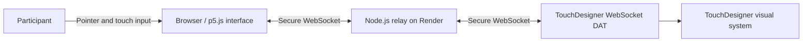

# Inkward Bound

[中文](README.zh-CN.md) | **English**

Inkward Bound is an interactive installation prototype that connects a browser-based touch interface to TouchDesigner. The browser translates touch and pointer behaviour into interaction data, while a Node.js WebSocket relay sends that data to the TouchDesigner visual system.

- [Live browser interface](https://inkward-bound.onrender.com)
- [Development process log](docs/PROCESS_LOG.md)
- [Git commit history](https://github.com/Yeri10/Inkward_Bound/commits/main)

## Interaction

Hold and move a pointer or finger across the browser canvas. The interface measures position, duration, movement speed, stability, agitation, click count, and an interpolated `c` value. These values drive five interaction states:

- Autonomous diffusion
- Human disturbance
- Latent search
- Temporary return
- Re-diffusion

Press `F` to enter or leave fullscreen mode.

## System architecture



The HTTP server and WebSocket relay share one public port. Local connections use `ws://`; the deployed interface and TouchDesigner use `wss://` through Render on port `443`.

## Repository structure

```text
Inkward_Bound/
├── InWard Bound System/
│   ├── Backup/                 # Numbered TouchDesigner iterations
│   ├── InWard Bound System.9.toe
│   └── InWard Bound System.toe # Current TouchDesigner file
├── InkWard_Bound_Interface/
│   ├── app.js                  # Express server and WebSocket relay
│   ├── package.json
│   └── public/
│       ├── index.html
│       ├── sketch.js           # Interaction, state and data logic
│       └── style.css
└── docs/
    ├── images/                 # Process sketches, models and screenshots
    ├── PROCESS_LOG.md
    ├── PROCESS_LOG.zh-CN.md
    ├── DATASET_CAPTURE_LOG.md
    └── DATASET_CAPTURE_LOG.zh-CN.md
```

## Run locally

Requirements: Node.js and npm.

```bash
cd InkWard_Bound_Interface
npm ci
npm start
```

Open `http://localhost:3000`.

For a local TouchDesigner connection, configure a WebSocket DAT with network address `localhost` and port `3000`. For the deployed service, use network address `inkward-bound.onrender.com` and port `443`.

## WebSocket message format

The interface sends JSON messages at interaction events and approximately 30 frames per second:

```json
{
  "event": "frame",
  "isTouching": true,
  "x": 0.5,
  "y": 0.5,
  "duration": 2.4,
  "speed": 0.12,
  "stability": 0.88,
  "agitation": 0.16,
  "clickCount": 1,
  "c": 0.42,
  "state": "search",
  "timestamp": 1782864000000
}
```

## Process evidence

The [process log](docs/PROCESS_LOG.md) links development decisions to dated commits and retained TouchDesigner versions. Future entries should add screenshots, short test results and focused commits so that visual and technical development can be reviewed together.

## Additional links

- [Development process documentation](docs/PROCESS_LOG.md)
- [Dataset capture and production log](docs/DATASET_CAPTURE_LOG.md)
- [Commit history](https://github.com/Yeri10/Inkward_Bound/commits/main)
- [Live browser interface](https://inkward-bound.onrender.com)
