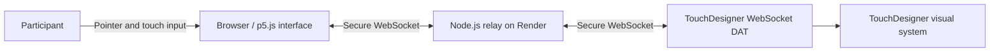

# Inkward Bound

[中文](README.zh-CN.md) | **English**

Inkward Bound is an interactive installation prototype that connects a browser-based touch interface to TouchDesigner. The browser translates touch and pointer behaviour into interaction data, while a Node.js WebSocket relay sends that data to the TouchDesigner visual system.

- [Live browser interface](https://inkward-bound.onrender.com)
- [Development process log](docs/PROCESS_LOG.md)
- [Git commit history](https://github.com/Yeri10/Inkward_Bound/commits/main)

## Interaction

Hold and move a pointer or finger across the browser canvas. The interface measures position, duration, movement speed, stability, agitation, click count, and an interpolated `c` value. These values drive five interaction states:

- Autonomous diffusion
- Human disturbance
- Latent search
- Temporary return
- Re-diffusion

Press `F` to enter or leave fullscreen mode.

## System architecture



The HTTP server and WebSocket relay share one public port. Local connections use `ws://`; the deployed interface and TouchDesigner use `wss://` through Render on port `443`.

## Repository structure

```text
Inkward_Bound/
├── InWard Bound System/
│   ├── Backup/                 # Numbered TouchDesigner iterations
│   ├── InWard Bound System.9.toe
│   └── InWard Bound System.toe # Current TouchDesigner file
├── InkWard_Bound_Interface/
│   ├── app.js                  # Express server and WebSocket relay
│   ├── package.json
│   └── public/
│       ├── index.html
│       ├── sketch.js           # Interaction, state and data logic
│       └── style.css
├── ink_dataset/                # Captured ink photographs with LoRA captions (see ink_dataset/README.md)
│   ├── 01_pure_diffusion/
│   ├── 02_layered_ink/
│   ├── 03_disturbed_ink/
│   ├── 04_gathering_ink/
│   ├── DATASET_CAPTURE_LOG.md
│   └── DATASET_CAPTURE_LOG.zh-CN.md
└── docs/
    ├── images/                 # Process sketches, models and screenshots
    ├── PROCESS_LOG.md
    └── PROCESS_LOG.zh-CN.md
```

## How to run

The system has two parts: the browser touch interface (input) and the TouchDesigner file (visual output), connected through a WebSocket relay. There are two ways to run it.

### Option A — Use the deployed service (quickest)

No installation needed for the interface.

1. Open the live browser interface: [https://inkward-bound.onrender.com](https://inkward-bound.onrender.com). Press `F` for fullscreen. (The free Render instance sleeps when idle; the first load may take up to a minute.)
2. Download or clone this repository, then open `InWard Bound System/InWard Bound System.toe` in TouchDesigner.
3. In the TouchDesigner WebSocket DAT (`ws_touch_input`), set network address `inkward-bound.onrender.com`, port `443`, and enable TLS/secure connection.
4. Touch and hold on the browser canvas; the values in `touch_store` should update in real time.

### Option B — Run everything locally

Requirements: Node.js and npm, plus TouchDesigner.

1. Download or clone the repository:

   ```bash
   git clone https://github.com/Yeri10/Inkward_Bound.git
   ```

2. Start the local server and relay:

   ```bash
   cd Inkward_Bound/InkWard_Bound_Interface
   npm ci
   npm start
   ```

3. Open `http://localhost:3000` in a browser.
4. Open `InWard Bound System/InWard Bound System.toe` in TouchDesigner and set the WebSocket DAT to network address `localhost`, port `3000` (no TLS).
5. Touch the browser canvas to drive the TouchDesigner visuals.

## WebSocket message format

The interface sends JSON messages at interaction events and approximately 30 frames per second:

```json
{
  "event": "frame",
  "isTouching": true,
  "x": 0.5,
  "y": 0.5,
  "duration": 2.4,
  "speed": 0.12,
  "stability": 0.88,
  "agitation": 0.16,
  "clickCount": 1,
  "c": 0.42,
  "state": "search",
  "timestamp": 1782864000000
}
```

## Process evidence

The [process log](docs/PROCESS_LOG.md) links development decisions to dated commits and retained TouchDesigner versions. Future entries should add screenshots, short test results and focused commits so that visual and technical development can be reviewed together.

## Additional links

- [Development process documentation](docs/PROCESS_LOG.md)
- [Dataset capture and production log](ink_dataset/DATASET_CAPTURE_LOG.md)
- [Commit history](https://github.com/Yeri10/Inkward_Bound/commits/main)
- [Live browser interface](https://inkward-bound.onrender.com)
