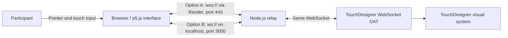
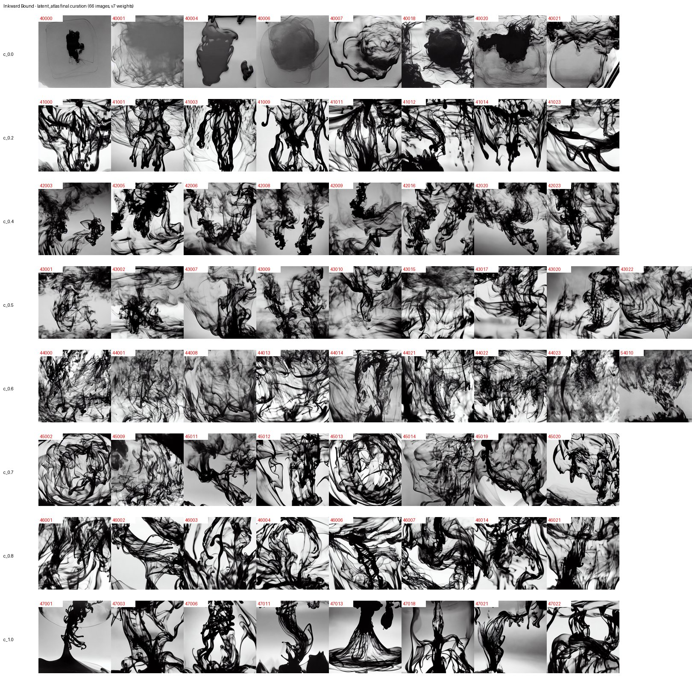

# Inkward Bound

[中文](README.zh-CN.md) | **English**

Inkward Bound is an interactive installation that connects a browser-based touch interface to TouchDesigner, where touch drives a hand-trained ink-diffusion visual system. The browser converts touch and pointer behaviour into a convergence value (`c`); a Node.js WebSocket relay sends it to TouchDesigner, which scrubs a latent-diffusion video — generated by a LoRA trained on 101 photographs of real ink in water — between dispersed and condensed states in real time.

The work's argument — from the temporal becoming of consciousness through to what a body still holds that a model cannot — is on the [project website](https://yeri10.github.io/Inkward_Bound/).

- [Project website](https://yeri10.github.io/Inkward_Bound/) — the work, the idea and the process in one place
- [Live browser interface](https://inkward-bound.onrender.com) — the touch interface itself
- [Development process log](docs/PROCESS_LOG.md) — dated entries linking decisions to commits
- [Dataset capture and production log](ink_dataset/DATASET_CAPTURE_LOG.md)
- [LoRA training pipeline and version history](training/README.md)
- [Commit history](https://github.com/Yeri10/Inkward_Bound/commits/main)

Every document above also exists in Chinese as a `.zh-CN.md` file alongside it.

## Interaction

Hold and move a pointer or finger across the browser canvas. The interface measures position, duration of contact, movement speed, stability and agitation, and folds them into a single convergence value:

```text
c = min(duration / 18, 1) × 0.7  +  stability × 0.3  −  agitation × 0.2
```

clamped to 0–1, approached smoothly while touching and decaying linearly on release. The weights sum to 1.0, so reaching the far end takes eighteen seconds of holding still — there is no way to simply set it. `clickCount` is also measured and reported, but it no longer feeds `c` or the state machine; it once held a floor under agitation, which meant a gesture that began with taps could never fully settle.

`c` and the raw measurements select one of five states, tested in this order:

| State | `state` in JSON | Condition |
|---|---|---|
| Re-diffusion | `rediffusion` | Not touching, `c` > 0.05 — the field unwinding after release |
| Human disturbance | `disturbance` | `agitation` > 0.55 or normalised speed > 0.65 |
| Temporary return | `return_` | Touching, `c` ≥ 0.75 and `stability` > 0.7 |
| Latent search | `search` | Touching, `c` ≥ 0.3 |
| Autonomous diffusion | `autonomous` | Everything else, including an untouched, settled field |

Press `F` to enter or leave fullscreen mode.

## The browser canvas

The browser canvas is not a controller that displays numerical feedback.
Instead, it follows the same visual logic as the projection, moving between
**diffused, disturbed, and condensed states**.

The image is made from large, soft nodes with different levels of brightness.
These nodes overlap to form brighter areas, and the brightness depends on how
much they overlap. As the state changes, the nodes slowly drift, gather, or
spread, creating a movement that is closer to the natural diffusion and
condensation of ink.

Different movement ratios are used to control the speed of each state:

| State | Ratio |
|---|---|
| Condensed | 0.0017 |
| Drift | 0.0004 |
| Diffused | 0.037 |
| Maximum | about 0.05 |

In early tests, the movement was faster and created strong trails, which made
the nodes look like objects swimming across the screen. In the final version,
the movement was slowed down. The nodes now change mainly through **growing,
fading, gathering, and spreading**, rather than quickly moving from one
position to another.

The brightness of the nodes also changes slightly over time. Nodes within the
same cluster change together, helping the image remain soft and stable while
still creating a sense of slow movement.

The canvas does not show touch lines or numerical information. When there is no
touch, a circular ring shows that the system is waiting for interaction. Once a
touch is received, the ring disappears.

## How to run

The system has two parts: the browser touch interface (input) and the TouchDesigner file (visual output), connected through a WebSocket relay. There are two ways to run it.

### Option A — Use the deployed service (quickest)

No installation needed for the interface.

1. Open the live browser interface: [https://inkward-bound.onrender.com](https://inkward-bound.onrender.com). Press `F` for fullscreen. (The free Render instance sleeps when idle; the first load may take up to a minute.)
2. Download or clone this repository, then open `InWard Bound System/InWard Bound System.toe` in TouchDesigner. The five axis videos are a [release asset](https://github.com/Yeri10/Inkward_Bound/releases/latest) rather than repository files — unzip `axis-videos.zip` into `InWard Bound System/Movie/` before opening the project. (One of the five is committed as a sample, so the patch opens either way; the other four resolve once the archive is in place.)
3. In the TouchDesigner WebSocket DAT (`ws_touch_input`), set network address `inkward-bound.onrender.com`, port `443`, and enable TLS/secure connection.
4. Touch and hold on the browser canvas; the values in `touch_store` should update in real time.

### Option B — Run everything locally

Requirements: Node.js and npm, plus TouchDesigner. This is the path used in the exhibition space: nothing depends on the internet, there is no cold start, and latency is lower.

1. Download or clone the repository:

   ```bash
   git clone https://github.com/Yeri10/Inkward_Bound.git
   ```

2. Start the local server and relay:

   ```bash
   cd Inkward_Bound/InkWard_Bound_Interface
   npm ci
   npm start
   ```

3. Open `http://localhost:3000` in a browser. To use a tablet as the touch surface, put it on the same network and open `http://<this machine's LAN IP>:3000` instead.
4. Open `InWard Bound System/InWard Bound System.toe` in TouchDesigner and set the WebSocket DAT to network address `localhost`, port `3000` (no TLS).
5. Touch the browser canvas to drive the TouchDesigner visuals.

## System architecture



The HTTP server and the WebSocket relay share one port, so the interface and TouchDesigner connect to the same address. Which scheme applies depends only on where the relay is running: `wss://` on port `443` when deployed to Render, `ws://` on port `3000` when local.

## WebSocket message format

The interface sends JSON messages at interaction events and approximately 30 frames per second:

```json
{
  "event": "frame",
  "isTouching": true,
  "x": 0.5,
  "y": 0.5,
  "duration": 2.4,
  "speed": 0.12,
  "stability": 0.88,
  "agitation": 0.16,
  "clickCount": 1,
  "c": 0.42,
  "state": "search",
  "timestamp": 1782864000000
}
```

The field names are a contract with the TouchDesigner patch — renaming one silently breaks the installation.

## LoRA training

The ink visuals themselves come from a LoRA (`inkwb`) trained on [ink_dataset/](ink_dataset/README.md), through seven iterative retrains (v1 → v7), each triggered by a specific diagnosed failure — container features leaking into the trigger word, a flat phase axis, seed-dependent state collapse, a top-down view that couldn't be recalled without summoning literal basins. Full version-by-version differences and evidence are in [training/README.md](training/README.md); reasoning for every round is logged in [docs/PROCESS_LOG.md](docs/PROCESS_LOG.md) (6–14 July 2026 entries).



The v7 weights produced a hand-curated 66-image latent atlas. That atlas is a set of stills at fixed coordinates; turning it into something `c` can scrub continuously happens in ComfyUI — keyframes drawn from the atlas are repainted through img2img, upscaled, RIFE-interpolated, and grained, producing five continuous axis videos. Each is re-encoded to HAP Q, because H.264 is inter-frame coded and scrubbing to an arbitrary frame would force a decode walk back to the nearest keyframe. The chain is documented in [training/README.md](training/README.md#from-atlas-to-video-comfyui).

## Repository structure

```text
Inkward_Bound/
├── InWard Bound System/
│   └── InWard Bound System.toe     # Current TouchDesigner file
│                                   # (numbered incremental saves are gitignored)
├── InkWard_Bound_Interface/         # (see its README)
│   ├── app.js                      # Express server and WebSocket relay
│   ├── package.json
│   └── public/
│       ├── index.html
│       ├── sketch.js               # Interaction, state and data logic
│       └── style.css
├── ink_dataset/                    # 101 captioned ink photographs (see its README)
│   ├── 01_pure_diffusion/          # …through 04_gathering_ink/
│   ├── README.md
│   └── DATASET_CAPTURE_LOG.md
├── training/                       # LoRA pipeline and v1 → v7 history (see its README)
│   ├── Inkward Bound LoRA Training.ipynb
│   ├── prepare_dataset.py
│   ├── train_text_to_image_lora.py
│   ├── measure_ink_coverage.py
│   ├── generate_atlas.py
│   ├── bake_transitions.py
│   └── comfyui_workflows/          # Exported graphs for the atlas → video stage
└── docs/                           # Also the source of the project website
    ├── index.html                  # Published at yeri10.github.io/Inkward_Bound
    ├── media/                      # Web-sized video
    ├── images/                     # Process sketches, models and screenshots
    └── PROCESS_LOG.md
```

## Process evidence

The [process log](docs/PROCESS_LOG.md) links development decisions to dated commits and retained TouchDesigner versions, so that visual and technical development can be reviewed together rather than as a finished result.
