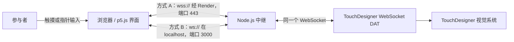

# Inkward Bound

**中文** | [English](README.md)

Inkward Bound 是一个将浏览器触摸界面与 TouchDesigner 连接起来的交互装置,触摸驱动的是一套经过训练的墨水扩散视觉系统。浏览器将触摸和指针行为转换为一个收敛值(`c` 值),Node.js WebSocket 中继服务器再将其发送至 TouchDesigner,由其实时播放一段潜扩散视频——由一个在 101 张真实墨水入水照片上训练出的 LoRA 生成——在离散与凝结两种状态之间移动。

- [项目网站](https://yeri10.github.io/Inkward_Bound/) —— 作品、理念与过程的完整呈现
- [在线浏览器界面](https://inkward-bound.onrender.com) —— 触摸界面本身
- [项目文本](docs/PROJECT_TEXT.zh-CN.md) —— 书面陈述
- [开发流程日志](docs/PROCESS_LOG.zh-CN.md) —— 按日期把决策与提交关联起来
- [Dataset 拍摄与制作日志](ink_dataset/DATASET_CAPTURE_LOG.zh-CN.md)
- [LoRA 训练管线与版本迭代记录](training/README.zh-CN.md)
- [Git 提交历史](https://github.com/Yeri10/Inkward_Bound/commits/main)

以上每份文档都有对应的英文版,文件名去掉 `.zh-CN` 即是。

## 交互方式

在浏览器画布上按住并移动鼠标或手指。界面会测量位置、按压时长、移动速度、稳定性与躁动程度,并把它们折算成一个收敛值:

```text
c = min(时长 / 18, 1) × 0.7  +  稳定性 × 0.3  −  躁动 × 0.2
```

结果被限制在 0–1 之间,按压时平滑趋近,松手后线性衰减。权重之和为 1.0,因此要走到轴的尽头需要静止按住十八秒——没有任何办法直接把它设成某个值。`clickCount` 仍然被测量并发送,但它已经不再参与 `c` 的计算,也不再影响状态判定;它曾经为躁动值托住一个下限,导致以连点开头的手势无论后来多么安静都无法完全沉降。

`c` 与各项原始测量值共同决定五种状态,按以下顺序判定:

| 状态 | JSON 中的 `state` | 条件 |
|---|---|---|
| 再扩散 | `rediffusion` | 未按压且 `c` > 0.05——松手之后正在散开的场 |
| 人为扰动 | `disturbance` | `agitation` > 0.55 或归一化速度 > 0.65 |
| 暂时回归 | `return_` | 按压中,`c` ≥ 0.75 且 `stability` > 0.7 |
| 潜在搜索 | `search` | 按压中,`c` ≥ 0.3 |
| 自主扩散 | `autonomous` | 其余情况,包括无人触碰、已经沉降的场 |

按 `F` 进入或退出全屏模式。

## 浏览器画布

画布不是一个带读数的控制器。它用自己的材料,同步运行投影上那同一个"弥散 → 凝结"的过程:
一片**密度场**,由大而柔、明暗不一的节点构成,聚成几处热区,以加法混合绘制——
**亮度来自何处重叠了多少,而不来自任何被画出来的形状**。`c` 通过抬高团心、压暗团缘让它聚拢;
节点自身也会漂移、汇聚、消散,但速度远比看上去慢。

画布上一切会动的东西都由一个数管着。**当一个辉光在一帧内走过接近自身半径的距离,
它会拖着一份正在消退的自我副本,而那份副本会被读成尾巴**——早先的流场版本在这个比值上是
0.165,一位观看者形容它像游动的精子。现在每一处运动在写之前都先核这个数:凝结 0.0017、
漂移 0.0004、消散 0.037,上限约 0.05。松手时的消散之所以交给"变大 + 淡出"而不是"飞回原位",
也是同一个原因:让节点在 1.4 秒内归位,比值是 0.149,尾巴立刻回来。

有两个幅度的实际表现只有其系数所声称的一部分,而且都属于**不报错、唯一症状是"功能看起来
像没做"**的那一类。**N 层各自波动 ±A 的东西叠加,合计只波动 ±A/√N**——节点级 ±15% 的闪烁
在二十层深的场里只剩 ±3%,所以闪烁改成按团相关,相关的波动不会被这样稀释。另一个是
p5 的 `noise()` 叠了四个倍频、数值大多落在 0.3–0.7,直接写 `(noise − 0.5) × 2`
只能拿到标称幅度的约四成。

手按下之后,画面上不存在任何画出来的线。**圆环属于待机状态**——那是作品在等待被触碰时
显示的东西,一被回应就消失。

完整参数表和每个选择背后的理由:
[`InkWard_Bound_Interface/INTERFACE_CONTEXT.md`](InkWard_Bound_Interface/INTERFACE_CONTEXT.md)。

## 如何运行

系统由两部分组成:浏览器触摸界面(输入)和 TouchDesigner 文件(视觉输出),二者通过 WebSocket 中继连接。有两种运行方式。

### 方式 A — 使用线上部署版(最快)

界面无需任何安装。

1. 打开在线浏览器界面:[https://inkward-bound.onrender.com](https://inkward-bound.onrender.com),按 `F` 进入全屏。(Render 免费实例闲置时会休眠,首次加载可能需要约一分钟。)
2. 下载或克隆本仓库,用 TouchDesigner 打开 `InWard Bound System/InWard Bound System.toe`。
3. 在 TouchDesigner 的 WebSocket DAT(`ws_touch_input`)中,Network Address 设为 `inkward-bound.onrender.com`,Network Port 设为 `443`,并启用 TLS/安全连接。
4. 在浏览器画布上按住并移动,`touch_store` 中的数值应实时更新。

### 方式 B — 完全本地运行

环境要求:Node.js 和 npm,以及 TouchDesigner。展览现场用的是这条路径:不依赖外网,没有冷启动,延迟也更低。

1. 下载或克隆仓库:

   ```bash
   git clone https://github.com/Yeri10/Inkward_Bound.git
   ```

2. 启动本地服务器与中继:

   ```bash
   cd Inkward_Bound/InkWard_Bound_Interface
   npm ci
   npm start
   ```

3. 在浏览器中打开 `http://localhost:3000`。若要用平板作为触摸面,把平板接入同一网络,改为打开 `http://<这台机器的局域网 IP>:3000`。
4. 用 TouchDesigner 打开 `InWard Bound System/InWard Bound System.toe`,将 WebSocket DAT 的 Network Address 设为 `localhost`,Network Port 设为 `3000`(不启用 TLS)。
5. 触摸浏览器画布即可驱动 TouchDesigner 视觉。

## 系统架构



HTTP 服务和 WebSocket 中继共用同一个端口,所以界面和 TouchDesigner 连的是同一个地址。用哪种协议只取决于中继跑在哪里:部署在 Render 上时是 `wss://` 加端口 `443`,本地运行时是 `ws://` 加端口 `3000`。

## WebSocket 消息格式

界面会在交互事件发生时发送 JSON,并以约每秒 30 帧的频率持续发送数据:

```json
{
  "event": "frame",
  "isTouching": true,
  "x": 0.5,
  "y": 0.5,
  "duration": 2.4,
  "speed": 0.12,
  "stability": 0.88,
  "agitation": 0.16,
  "clickCount": 1,
  "c": 0.42,
  "state": "search",
  "timestamp": 1782864000000
}
```

这些字段名是与 TouchDesigner 工程之间的契约,改掉任何一个都会让装置无声地失效。哪些部分可以放心重写、哪些不能,见 [`InkWard_Bound_Interface/INTERFACE_CONTEXT.md`](InkWard_Bound_Interface/INTERFACE_CONTEXT.md)。

## LoRA 训练

装置里的墨水视觉本身来自一个在 [ink_dataset/](ink_dataset/README.zh-CN.md) 上训练的 LoRA(`inkwb`),经过七次迭代重训(v1 → v7),每一次都是被具体诊断出的问题推着走的——容器特征泄漏进触发词、阶段轴拉不出差异、seed 相关的状态塌陷、俯拍视角怎么写都会连带召唤出真实的水盆。完整的版本差异和证据见 [training/README.zh-CN.md](training/README.zh-CN.md);每一轮的推理过程记在 [docs/PROCESS_LOG.zh-CN.md](docs/PROCESS_LOG.zh-CN.md)(2026 年 7 月 6 日–14 日的条目)。


v7 权重生成出手工精选的 66 张 latent atlas。这份 atlas 是一组固定坐标上的静帧;把它变成 `c` 值可以连续 scrub 的东西,是在 ComfyUI 里完成的——从 atlas 中抽出关键帧,经 img2img 重绘、放大、RIFE 插帧与加颗粒,生成五段连续的轴向视频。每段都再编码为 HAP Q,因为 H.264 是帧间编码,scrub 到任意一帧都会迫使解码器回溯到最近的关键帧。完整链路见 [training/README.zh-CN.md](training/README.zh-CN.md#从-atlas-到视频comfyui)。

## 仓库结构

```text
Inkward_Bound/
├── InWard Bound System/
│   └── InWard Bound System.toe     # 当前 TouchDesigner 文件
│                                   #（编号递增的存档已被 gitignore）
├── InkWard_Bound_Interface/
│   ├── app.js                      # Express 服务与 WebSocket 中继
│   ├── INTERFACE_CONTEXT.md        # 哪些部分可以重写，哪些会让装置失效
│   ├── package.json
│   └── public/
│       ├── index.html
│       ├── sketch.js               # 交互、状态和数据逻辑
│       └── style.css
├── ink_dataset/                    # 101 张带 caption 的墨水照片（见其 README）
│   ├── 01_pure_diffusion/          # …至 04_gathering_ink/
│   ├── README.zh-CN.md
│   └── DATASET_CAPTURE_LOG.zh-CN.md
├── training/                       # LoRA 管线与 v1 → v7 迭代记录（见其 README）
│   ├── Inkward Bound LoRA Training.ipynb
│   ├── prepare_dataset.py
│   ├── train_text_to_image_lora.py
│   ├── measure_ink_coverage.py
│   ├── generate_atlas.py
│   ├── bake_transitions.py
│   └── comfyui_workflows/          # atlas → 视频阶段导出的 ComfyUI 图
└── docs/                           # 同时也是项目网站的源文件
    ├── index.html                  # 发布于 yeri10.github.io/Inkward_Bound
    ├── media/                      # 网页尺寸的视频
    ├── images/                     # 过程草图、模型与截图
    ├── PROJECT_TEXT.zh-CN.md
    └── PROCESS_LOG.zh-CN.md
```

## 过程证据

[开发流程日志](docs/PROCESS_LOG.zh-CN.md)把设计决策与带日期的 Git 提交、TouchDesigner 保留版本相互链接,使视觉与技术的发展可以被共同审阅,而不是只看到一个完成的结果。
