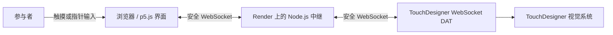

# Inkward Bound

**中文** | [English](README.md)

Inkward Bound 是一个将浏览器触摸界面与 TouchDesigner 连接起来的交互装置原型。浏览器将触摸和指针行为转换为交互数据，Node.js WebSocket 中继服务器再将数据发送至 TouchDesigner 视觉系统。

- [在线浏览器界面](https://inkward-bound.onrender.com)
- [开发流程日志](docs/PROCESS_LOG.zh-CN.md)
- [Git 提交历史](https://github.com/Yeri10/Inkward_Bound/commits/main)

## 交互方式

在浏览器画布上按住并移动鼠标或手指。界面会测量位置、持续时间、移动速度、稳定性、躁动程度、点击次数以及插值参数 `c`。这些数值驱动五种交互状态：

- 自主扩散（Autonomous diffusion）
- 人为扰动（Human disturbance）
- 潜在搜索（Latent search）
- 暂时回归（Temporary return）
- 再扩散（Re-diffusion）

按 `F` 进入或退出全屏模式。

## 系统架构



HTTP 服务和 WebSocket 中继共用同一个公网端口。本地连接使用 `ws://`；部署后的界面和 TouchDesigner 通过 Render 的 `443` 端口使用 `wss://`。

## 仓库结构

```text
Inkward_Bound/
├── InWard Bound System/
│   ├── Backup/                 # 编号保存的 TouchDesigner 迭代版本
│   ├── InWard Bound System.9.toe
│   └── InWard Bound System.toe # 当前 TouchDesigner 文件
├── InkWard_Bound_Interface/
│   ├── app.js                  # Express 服务与 WebSocket 中继
│   ├── package.json
│   └── public/
│       ├── index.html
│       ├── sketch.js           # 交互、状态和数据逻辑
│       └── style.css
├── ink_dataset/                # 实拍墨水照片与 LoRA caption（见 ink_dataset/README.zh-CN.md）
│   ├── 01_pure_diffusion/
│   ├── 02_layered_ink/
│   ├── 03_disturbed_ink/
│   ├── 04_gathering_ink/
│   ├── DATASET_CAPTURE_LOG.md
│   └── DATASET_CAPTURE_LOG.zh-CN.md
└── docs/
    ├── images/                 # 过程草图、模型与截图
    ├── PROCESS_LOG.md
    └── PROCESS_LOG.zh-CN.md
```

## 本地运行

环境要求：Node.js 和 npm。

```bash
cd InkWard_Bound_Interface
npm ci
npm start
```

打开 `http://localhost:3000`。

TouchDesigner 本地连接：WebSocket DAT 的 Network Address 设为 `localhost`，Network Port 设为 `3000`。连接部署版本时，Network Address 使用 `inkward-bound.onrender.com`，Network Port 使用 `443`。

## WebSocket 消息格式

界面会在交互事件发生时发送 JSON，并以约每秒 30 帧的频率持续发送数据：

```json
{
  "event": "frame",
  "isTouching": true,
  "x": 0.5,
  "y": 0.5,
  "duration": 2.4,
  "speed": 0.12,
  "stability": 0.88,
  "agitation": 0.16,
  "clickCount": 1,
  "c": 0.42,
  "state": "search",
  "timestamp": 1782864000000
}
```

## 过程证据

[开发流程日志](docs/PROCESS_LOG.zh-CN.md)把设计决策与带日期的 Git 提交、TouchDesigner 保留版本相互链接。后续记录应继续加入截图、简短测试结果以及范围明确的提交，使视觉与技术开发可以被共同审阅。

## 附加链接

- [开发流程文档](docs/PROCESS_LOG.zh-CN.md)
- [Dataset 拍摄与制作日志](ink_dataset/DATASET_CAPTURE_LOG.zh-CN.md)
- [Git 提交历史](https://github.com/Yeri10/Inkward_Bound/commits/main)
- [在线浏览器界面](https://inkward-bound.onrender.com)
