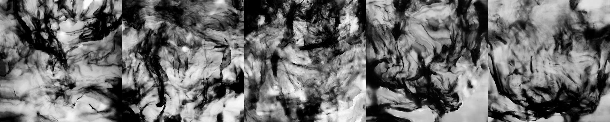

# Inkward Bound — 开发流程日志

**中文** | [English](PROCESS_LOG.md)

## 目的

本日志记录 Inkward Bound 在浏览器界面、WebSocket 中继、部署和 TouchDesigner 系统之间的开发过程。它参考 Pippin Barr 的 [The Artist Is Present 2](https://github.com/pippinbarr/the-artist-is-present-2/blob/master/press/README.md) 所采用的过程文档方法：项目介绍不仅展示最终成果，还应链接到过程记录和 Git 历史。

每条记录分别说明：

1. 开发意图或问题；
2. 已完成的工作；
3. 决策及其原因；
4. 仓库中已有的证据；
5. 反思与下一步测试。

## 证据索引

- [完整 Git 提交历史](https://github.com/Yeri10/Inkward_Bound/commits/main)
- [当前浏览器界面](../InkWard_Bound_Interface/public/sketch.js)
- [当前服务器与 WebSocket 中继](../InkWard_Bound_Interface/app.js)
- [当前 TouchDesigner 系统](../InWard%20Bound%20System/InWard%20Bound%20System.toe)
- [TouchDesigner 迭代备份](../InWard%20Bound%20System/Backup)
- [Dataset 拍摄与制作日志](../ink_dataset/DATASET_CAPTURE_LOG.zh-CN.md)
- [Render 在线部署](https://inkward-bound.onrender.com)

## 开发时间线

### 2026 年 5 月 31 日 — 第一版装置草图与初始建模

**开发意图**

将“意识碎片、熵增与重新收敛”的概念转化为空间装置结构，并初步定义观众输入、屏幕分工与声音变化之间的关系。

**已完成工作**

- 绘制第一版装置草图，将互动数据与概念含义对应：按住时长对应注意持续时间，触摸稳定性对应内在静止，点击频率对应躁动，松开对应意识再次逸散，触摸位置对应召回方向。
- 提出将这些数据转换为收敛值，用于控制意识碎片重新聚合的强度。
- 规划声音状态：高熵状态使用破碎呼吸、数字噪声和不稳定频率；低熵状态逐渐变慢、变清晰并接近静默。
- 建立第一版 3D 装置模型：两块主要屏幕、多个小型屏幕和一块交互屏幕沿垂直线缆主干密集排列。
- 输出正面与侧向视角的两张建模图。

**设计决策**

第一版采用多屏密集堆叠，而不是单屏结构。暴露的线缆和不规则屏幕排列用于表现意识碎片、信息纠缠与不稳定状态；下方横向屏幕被定义为观众交互入口，上方主要屏幕承担墨迹扩散和潜在空间视觉，小屏幕用于显示漂移的意识碎片。

**证据**

- [第一版装置概念手绘草图](images/2026-05-31-initial-installation-concept-sketch.jpg)
- [第一版装置建模正面视图](images/2026-05-31-initial-installation-model-front.png)
- [第一版装置建模侧向视图](images/2026-05-31-initial-installation-model-angle.png)
- 本机文件创建时间：两张建模图分别为 2026-05-31 17:41 和 17:45，手绘草图为 2026-05-31 22:04（BST）。文件未包含可读取的内嵌 EXIF 日期，因此该日期依据本机文件系统时间。

**反思 / 下一步**

第一版已经提出多屏、交互数据和熵状态之间的关系，但屏幕数量较多、层级较密，观众界面、主要视觉输出和系统状态之间的功能边界仍不清晰。后续版本应简化屏幕层级，并明确不同屏幕的观看对象和作用。

---

### 2026 年 6 月 8 日 — 建立项目仓库

**开发意图**

在整合可运行原型之前，为项目建立版本控制空间。

**已完成工作**

- 初始化 Git 仓库。
- 添加用于文件处理的 Git attributes。

**证据**

- Commit [`64278d5`](https://github.com/Yeri10/Inkward_Bound/commit/64278d5) — `Initial commit`

**反思 / 下一步**

这个提交建立了仓库，但尚未呈现设计或技术过程。下一步是开始制作并测试装置原型。

---

### 2026 年 6 月 10 日 — 建立网页与 TouchDesigner 的完整数据桥接

**开发意图**

将浏览器界面与 TouchDesigner 整合成一个完整的交互系统，确立网页作为轻量输入层、TouchDesigner 负责视觉处理和装置输出的技术架构。

**已完成工作**

- 建立 Express 静态服务器（`server.js`，port `3000`）和 WebSocket 中继（port `9980`）。
- 完成 p5.js 粒子界面（`sketch.js`）：180 个粒子响应 Perlin 噪声，支持鼠标与触摸输入。
- 在浏览器端计算位置、持续时间、速度、稳定性、躁动程度、点击次数和 `c` 值，通过 WebSocket 发送给 TouchDesigner。
- 加入底部 HUD，实时显示连接状态与交互数值。
- 在 TouchDesigner 中搭建接收链路：`ws_touch_input` → `ws_parser` → `touch_store` → `c_value_chop`。
- 验证端到端数据流通：`touch_store` 的 `timestamp` 字段随浏览器触摸实时更新。

**技术决策**

浏览器不只发送原始坐标，而是先计算更高层级的行为数据（`stability`、`agitation`、`c` 值）。这样 TouchDesigner 通过一个稳定的数据接口，就能将静止、躁动等交互特征直接映射到视觉参数，避免在 TD 端重复计算。

WebSocket 使用 Node.js 中继，而不是让 TD 直接作为 WebSocket 服务端。测试发现 TD 的 WebSocket DAT 在客户端模式（连接到外部中继）下回调机制更可靠。

**关键 bug 修复**

点击画布无反应。根本原因是 p5.js 封装函数（`rand`、`noiseFn` 等）在 p5 初始化之前就被定义，导致静默失败。解决方案是删除所有封装函数，直接使用 p5 全局函数，并将 `connectWS()` 移入 `setup()` 内部调用。

**相关文件与证据**

- `InkWard_Bound_Interface/server.js`（该阶段使用的文件名，后续已重命名为 `app.js`）
- [`InkWard_Bound_Interface/public/sketch.js`](../InkWard_Bound_Interface/public/sketch.js)
- [`InkWard_Bound_Interface/public/index.html`](../InkWard_Bound_Interface/public/index.html)
- `系统搭建测试记录/td数据接收.mov`（屏幕录像：TD 接收到实时数据；当前未存入仓库）
- `系统搭建测试记录/使用TD的粒子噪声系统测试c_value_chop的输出.mov`（当前未存入仓库）
- 项目作者补充的回顾性过程记录；后续代码与 TouchDesigner 文件集中保存在 Commit [`c0e3e20`](https://github.com/Yeri10/Inkward_Bound/commit/c0e3e20) 中。

**反思**

这个阶段的工作量较大，几个方向同时推进。下一步应将 TouchDesigner 的每次修改分开记录，并附截图说明网络结构或视觉变化，让迭代过程更清晰可追溯。

---

### 2026 年 6 月 12 日 — 第二版装置概念重构

**开发意图**

重新组织第一版密集垂直堆叠的多屏结构，建立更清晰的主体框架，并将主要视觉空间与观众交互入口分开。

**视觉修改**

- 将第一版的单根垂直线缆主干改为可独立站立的矩形金属框架。
- 在框架内部使用多层黑色和半透明平面，形成具有深度的主视觉区域。
- 将三块渐变小屏分布在框架边缘，继续表达漂移的意识碎片。
- 将彩色交互屏从主体结构中分离，放置在独立基座上，使观众输入与主视觉输出形成明确分工。
- 保留悬浮、错位和重叠的视觉语言，但开始建立更清晰的结构边界。

**设计决策**

这次修改不是“从单屏变为双屏”，而是从第一版的多屏密集堆叠，转向“主体视觉框架 + 独立交互终端”的空间组织。分离后的交互终端为观众提供明确入口，主体框架则专注呈现意识碎片、扩散和收敛。

**证据**

- [第二版装置概念图](images/2026-06-12-second-version-concept.png)
- 本机文件创建时间：2026-06-12 21:08（BST）。文件未提供可读取的内嵌 EXIF 日期，日期依据本机文件系统时间。

**反思 / 下一步**

第二版已经明确主体与交互终端的关系，但内部平面、小屏和基座仍然较多。后续需要通过连续建模测试逐步删减组件，确认哪些元素真正参与概念表达。

---

### 2026 年 6 月 22–29 日 — 墨水扩散 Dataset 拍摄

**开发意图**

拍摄不同材料和外力作用下的墨水扩散形态，为装置的黑白墨迹视觉、Latent Atlas 素材和 TouchDesigner 状态变化建立实物参考。

**已完成工作**

- 在 6 月 22、26、29 日完成三组实验。
- 使用相机与手机拍摄，并测试两个手机灯和傍晚柔光。
- 比较水、墨水、盐/盐水、洗手液，以及筷子、小棍子和滴管产生的视觉差异。
- 测试自然扩散、向四周搅动、中间小范围搅动和滴管操作。
- 于 7 月 1 日将代表帧整理为 8 张带参数说明的 contact sheets。

**证据**

- [Dataset 拍摄与制作日志](../ink_dataset/DATASET_CAPTURE_LOG.zh-CN.md)
- [Dataset contact sheets](images/dataset_record/)

**反思 / 下一步**

现有记录能够证明材料、工具、设备和灯光变量，但原始文件数量、分辨率、帧率、材料用量及筛选淘汰过程仍需补充。下一步应将代表形态与具体 TouchDesigner 状态或 Latent Atlas 分类建立可测试的映射。

---

### 2026 年 6 月 23–25 日 — 第二版视觉结构的连续删减与调整

**开发意图**

通过连续三次建模输出，测试框架、屏幕、中央视觉体和交互终端的组合方式，逐步减少不必要的结构。

**视觉迭代**

- **6 月 23 日：** 将主体扩展为较开放的双框架结构，加入黑色中央体、多个悬浮屏幕、独立彩色终端以及额外白色模块，测试不同组件在空间中的距离和方向。
- **6 月 24 日：** 减少外部基座与部分中央组件，使结构更开放；将彩色终端靠近主体，强化主体与交互界面的联系。
- **6 月 25 日：** 继续减少渐变屏和中央白色体的数量，保留主要框架、黑色背景体、少量碎片屏幕与彩色交互终端。

**设计决策**

这三次修改采用逐步删减的方法：不再通过增加屏幕表达复杂性，而是依靠框架、空隙、半透明层和少量错位屏幕表达意识碎片。交互终端继续保持在主体外部，以维持功能区分。

**证据**

- [6 月 23 日视觉测试](images/2026-06-23-installation-visual-study-03.png)
- [6 月 24 日视觉测试](images/2026-06-24-installation-visual-study-04.png)
- [6 月 25 日视觉测试](images/2026-06-25-installation-visual-study-05.png)
- 本机文件创建时间分别为 2026-06-23 16:09、2026-06-24 18:25 和 2026-06-25 22:03（BST）。

**反思 / 下一步**

连续删减使视觉中心更明确，但主体仍由多个相互独立的框架和平面构成。下一步需要把结构进一步收束为一个可制造、可布线且具有明确观看方向的整体框架。

---

### 2026 年 6 月 30 日 — 将原型与 TouchDesigner 迭代集中存入仓库

**开发意图**

将 6 月 10 日开始形成的数据桥接原型、浏览器代码和 TouchDesigner 迭代版本集中纳入 Git 版本控制。

**已完成工作**

- 加入 TouchDesigner 第 1–8 个编号版本。
- 加入当前 `.toe` 系统文件。
- 加入已经开发的 p5.js 浏览器界面、状态模型和 HUD。
- 加入已经开发的 Express 服务器与 WebSocket 中继。

**技术决策**

这次提交的重点是保存此前的开发成果，而不是代表所有功能都在 6 月 30 日当天完成。

**证据**

- Commit [`c0e3e20`](https://github.com/Yeri10/Inkward_Bound/commit/c0e3e20) — `I add some files`
- [`sketch.js`](../InkWard_Bound_Interface/public/sketch.js)
- [TouchDesigner 备份文件](../InWard%20Bound%20System/Backup)

**反思 / 下一步**

这个提交包含大量工作，但范围过大，无法清楚显示开发顺序，提交信息也没有准确描述内容。编号 `.toe` 文件能说明发生过迭代，但二进制文件无法提供可读 diff。今后的 TouchDesigner 修改应分别提交，并附加截图和网络或视觉变化说明。

---

### 2026 年 6 月 30 日 — 明确 Node 入口文件

**问题**

部署入口文件需要与应用命名及 npm 配置保持一致。

**已完成工作**

- 将 `server.js` 重命名为 `app.js`。
- 更新 `package.json` 中的 `main` 字段和 `npm start` 命令。

**证据**

- Commit [`c5fc728`](https://github.com/Yeri10/Inkward_Bound/commit/c5fc728) — `I change some codes`

**反思 / 下一步**

源文件与 package 配置已经一致，但第一次 Render 部署暴露了另一个问题：服务最初从错误的工作目录寻找入口文件。

---

### 2026 年 6 月 30 日 — 调整为兼容 Render 的 WebSocket 网络结构

**问题**

本地原型的 HTTP 与 WebSocket 使用不同端口，但 Render Web Service 的公网 HTTP 和 WebSocket 流量必须进入同一个公开监听端口。HTTPS 页面还要求使用安全 WebSocket。

**已完成工作**

- 创建由 Express 和 `WebSocketServer` 共用的 HTTP server。
- 使用 Render 提供的 `PORT` 环境变量，并监听 `0.0.0.0`。
- 删除独立的公网 WebSocket 端口 `9980`。
- 让浏览器在本地自动使用 `ws://`，在 HTTPS 环境自动使用 `wss://`。
- 中继数据时保留文本和二进制消息类型。

**技术决策**

现在由同一来源提供网页，并完成 WebSocket 协议升级。这避免了写死的部署端口，使浏览器和 TouchDesigner 可以通过 Render 域名的 `443` 端口连接。

**证据**

- Commit [`42c9a6d`](https://github.com/Yeri10/Inkward_Bound/commit/42c9a6d) — `change network port`
- [`app.js`](../InkWard_Bound_Interface/app.js)

**反思 / 下一步**

部署配置和应用网络结构现已对齐。下一步证据应包括：Render 成功部署截图、浏览器 HUD 连接成功截图，以及 TouchDesigner WebSocket DAT 收到 JSON 的画面。

---

### 2026 年 7 月 1 日 — TouchDesigner 第 9 版与展示控制

**开发意图**

保留新的 TouchDesigner 迭代版本，并让浏览器界面能够在没有浏览器栏的情况下展示。

**已完成工作**

- 将 TouchDesigner 第 8 版归档到 `Backup/`。
- 添加第 9 版并更新当前 `.toe` 文件。
- 添加 `F` 键全屏切换。
- 保持画布随浏览器窗口变化自动调整。

**证据**

- Commit [`1bc18a2`](https://github.com/Yeri10/Inkward_Bound/commit/1bc18a2) — `add some codes`
- [`InWard Bound System.9.toe`](../InWard%20Bound%20System/InWard%20Bound%20System.9.toe)
- [`sketch.js`](../InkWard_Bound_Interface/public/sketch.js) 中的全屏处理函数

**反思 / 下一步**

编号 `.toe` 文件和全屏代码已保存，但提交没有说明 TouchDesigner 第 8 版与第 9 版之间的视觉差异。下一条记录应加入对比截图或简短录屏。

---

### 2026 年 7 月 1 日 — 框架收束与半透明包覆测试

**开发意图**

把此前分散的双框架和悬浮平面整合为一个更完整的装置体量，并测试半透明材料如何影响内部视觉的可见性。

**视觉修改**

- 凌晨版本将上下横梁与四根立柱连接为完整矩形框架，减少外围渐变屏和独立模块，把主要视觉集中在框架内部。
- 保留外置彩色交互屏，使观众输入界面与内部生成视觉继续分离。
- 21:03 的 Blender 工作截图记录了正式渲染前的建模现场：完整框架、小型渐变屏、外置彩色屏和侧面模块已经放置在同一场景中，并在渲染视图中检查材质、位置和阴影关系。
- 晚间版本在框架表面加入大面积半透明包覆层，使内部白色视觉体变为模糊、发光的形态。
- 结构语言从“多个碎片并置”进一步转向“碎片被容纳在一个半透明空间中”。

**设计决策**

完整框架提高了结构可制造性，也提供了悬挂屏幕、隐藏布线和固定半透明材料的共同边界。半透明表面让内部图像不能被一次完全读取，与项目关于意识显现、逸散和重新聚合的概念更一致。

**证据**

- [7 月 1 日框架收束测试](images/2026-07-01-installation-frame-study-06.png)
- [7 月 1 日 Blender 建模过程截图](images/2026-07-01-blender-frame-work-in-progress.png)
- [7 月 1 日半透明包覆测试](images/2026-07-01-installation-enclosure-study-07.png)
- 本机文件创建时间依次为 2026-07-01 01:50、21:03 和 21:10（BST）；最后一张图于 21:28 修改。

**反思 / 下一步**

当前方向比早期多屏堆叠更统一，但半透明材料的实际透光率、投影亮度、屏幕固定方式、散热和维护空间仍需通过实体材料测试确认。

### 2026 年 7 月 2 日 — 墨水数据集 LoRA 打标

**开发意图**

为 `ink_dataset/` 中的 101 张实拍墨水照片完成 LoRA 训练打标，使训练出的模型能够生成可由收束值导航的 pre-baked latent atlas。

**已完成工作**

- 通过拼接缩略图逐张核对图像，为每张图写同名 `.txt` caption（kohya / AI Toolkit 格式）。
- 确定 caption 结构：`inkwb, <状态短语>, <阶段短语>, <单图形态描述>, monochrome, high contrast`。
- 按帧在实验序列中的位置分配时间阶段短语（`early / developing / advanced / final phase`），例如 `1-1.jpg` → `1-4.jpg` 为同一次扩散过程。
- 将 `04_gathering_ink/3-2-.jpg` 改名为 `3-2.jpg`。
- 在 [`ink_dataset/README.md`](../ink_dataset/README.md) 与 [`ink_dataset/README.zh-CN.md`](../ink_dataset/README.zh-CN.md) 中记录结构说明。
- 归并数据集文档：将 `DATASET_CAPTURE_LOG`（中英）从 `docs/` 移入 `ink_dataset/`，使拍摄、打标与训练证据集中在图像旁边。
- 更新主 README 与本日志中的全部交叉引用，并修复此前 `docs/images/dataset` → `docs/images/dataset_record` 改名导致的 contact sheet 图片链接失效。

**决策及原因**

选用无既有语义的触发词 `inkwb` 吸收整体风格、避免与既有概念冲突；caption 采用自然语言以兼容 Flux / SDXL 类训练。把序列位置编码为阶段短语，使拍摄的时间推进变为可提示控制的参数，直接映射 c 值轴（如 `final phase of gathering` 对应临时回流）。接近全黑的帧予以保留，阶段短语使其作为扩散终态具有语义价值。

**证据**

- `ink_dataset/` 四个子文件夹中的 101 个 `.txt` caption 文件。
- [`ink_dataset/README.zh-CN.md`](../ink_dataset/README.zh-CN.md) — 结构、caption 格式与 c 值映射。

**反思 / 下一步**

Caption 已与图像一一对应并通过完整性验证，但效果尚未检验。下一步先跑一轮 LoRA 训练，评估状态与阶段词汇在生成中是否真正可控，再批量产出 atlas 图像。

---

### 2026 年 7 月 6 日 — 从 The-Latent-Mycelium 迁移 LoRA 训练管线

**开发意图**

复用此前项目 [The-Latent-Mycelium](https://github.com/Yeri10/The-Latent-Mycelium) 已验证的 SD 1.5 训练管线，为 `inkwb` LoRA 搭建训练基础设施，而不是从零构建。

**已完成工作**

- 审读 The-Latent-Mycelium，确认可复用部分：diffusers LoRA 训练脚本、conda 环境、生成器类、NDI 发送与缓冲播放代码，以及 `mycelium_lora_structure_v1`（80 张图）成功训练的超参数。
- 新建 `training/`：`train_text_to_image_lora.py`（原样复制）、`prepare_dataset.py` 和训练 README。
- `prepare_dataset.py` 将 `ink_dataset/` 的 kohya 式 caption 转换为 diffusers 格式（`training/dataset/images/` 最长边 1024 px + `metadata.jsonl`）；已运行并生成 101 条记录。

**决策及原因**

沿用 mycelium 超参数（512 分辨率、rank 16、lr 5e-5、batch 1 + 梯度累积 4、12 epochs）作为已验证的起点。禁用 `random_flip`，因为墨水 caption 编码了左右方位。映射层后续重写：PM2.5 → density/tangle 短语改为 c 值 → 状态/阶段/视角短语，正好对应 7 月 2 日定义的 caption 词汇。

**证据**

- [`training/README.md`](../training/README.md)、[`training/prepare_dataset.py`](../training/prepare_dataset.py)
- `training/dataset/metadata.jsonl` — 由 caption 生成的 101 条记录。

**反思 / 下一步**

管线尚未在本数据集上实测。下一步：在 Mac Studio 上跑 `inkwb_lora_v1`，用训练 README 的清单评估（状态 / 阶段 / 视角可控性），再决定 caption 词汇是否需要二次调整，然后批量生成 latent atlas。

---

### 2026 年 7 月 6 日 — 首次训练复盘：容器特征泄漏进触发词

**问题**

`inkwb_lora_v1` 的首批预览图复现了拍摄容器的特征——缸壁、弧形容器底、水面线和气泡。原因是这些反复出现的特征没有写进 caption，被模型吸收进了触发词。

**已完成工作**

- 为全部 101 条 caption 增加容器语境部分：`inside a shallow pale basin`（01）/ `inside a clear water tank`（02–04），并对明显可见的图补充 `curved basin rim visible`、`water surface line at the top`、`reflective tank floor below`。
- 在 notebook 的 Inference Test cell 加入负面提示（glass、tank、vessel walls、rim、surface line、reflection、bubbles）。
- 更新 ink_dataset README 的 caption 格式说明，重新生成含 Container 列的 `ink_dataset_captions.xlsx`。

**决策及原因**

先不裁剪照片，而是把容器特征绑定到明确的 caption 词汇上，生成时用负面提示排除。裁剪保留为 v2 预览仍受污染时的后备方案，因为裁剪会同时改变形态描述所依赖的构图信息（留白、方位）。

**证据**

- [v1 预览：缸壁与水面线](images/2026-07-06-inkwb-lora-v1-baseline-01-container-leak.png)、[v1 预览：弧形容器底](images/2026-07-06-inkwb-lora-v1-baseline-02-container-leak.png)
- `ink_dataset/` 全部 caption 文件；[`ink_dataset/README.zh-CN.md`](../ink_dataset/README.zh-CN.md) 格式表。
- [`training/Inkward Bound LoRA Training.ipynb`](../training/Inkward%20Bound%20LoRA%20Training.ipynb) 中的负面提示。

**反思 / 下一步**

重跑 `prepare_dataset.py`，训练 `inkwb_lora_v2`，用相同 seed 与 v1 预览对比。若容器特征仍存在，则在 `prepare_dataset.py` 中加入逐图裁剪，并同步修改受影响 caption 的方位词。

---

### 2026 年 7 月 6 日 — v1/v2 预览对比：真实感、prompt 调整与验收标准

**问题**

对比两次训练的 phase-control 预览发现 v1 看起来比 v2 更"真实"。v1 的真实感很大程度上正来自泄漏的容器特征——水面折射、玻璃光泽和高光反射本身就是摄影证据，去掉容器时它们也被一并去掉。v2 的负面提示同时存在误伤：`glass`、`reflection` 这类宽泛词压掉了密实墨水的湿润光泽。v2 预览仍残留缸壁和底部墨渍横条。另外，相同 seed 下四个阶段 prompt 生成的图几乎一致，说明阶段词单独使用可控性很弱。

**已完成工作**

- 收窄负面提示至具体特征（`tank walls, basin rim, water surface line, bubbles, table edge, dark smears at the bottom edge`），去掉 `glass / reflection / vessel`。
- 所有测试 prompt 加入正面摄影词（`macro photograph, wet glossy ink, soft light`），把真实感变为明确要求而非依赖容器泄漏。
- 强化 phase-control prompt：每个阶段词配对相应的形态描述（小墨团下沉 → 墨叶下漂 → 重块凝聚 → 墨丘沉底）。
- 仅修改 prompt，无需重训即可重新评估。

**决策及原因**

真实感不是训练目标。为 LoRA 定义了验收标准，按重要性排序：（1）词汇可控——状态、阶段、视角各自产生可区分的结果，c 值导航依赖于此；（2）风格干净——容器特征仅在 prompt 提及时出现；（3）seed 多样性——同一 prompt 换 seed 产生不同构图；（4）不过拟合——生成图不是训练照片的复印。真实感只需在观展距离下成立，且 atlas 经人工筛选，60–70% 可用率即足够。

**证据**

- [v1 阶段预览：early](images/2026-07-06-inkwb-lora-v1-phase-early.png)、[v1 阶段预览：final](images/2026-07-06-inkwb-lora-v1-phase-final.png) —— 摄影感由泄漏的容器线索承载；early 与 final 几乎一致。
- [v2 阶段预览：early](images/2026-07-06-inkwb-lora-v2-phase-early.png)、[v2 阶段预览：final](images/2026-07-06-inkwb-lora-v2-phase-final.png) —— 更干净但更平；残留缸壁与底部墨渍横条。
- [v1 完整预览总览](images/2026-07-06-inkwb-lora-v1-preview-sheet.png) —— 第一次训练的 baseline、状态、阶段、视角四组。
- [v2 完整预览总览](images/2026-07-06-inkwb-lora-v2-preview-sheet.png) —— caption 修正后的同四组。
- [`training/Inkward Bound LoRA Training.ipynb`](../training/Inkward%20Bound%20LoRA%20Training.ipynb) 更新后的 Inference Test cell。

**完整评估（查看 v1、v2 全部预览组后补充）**

对比完整预览集修正了此前的判断。v1：状态可分且具有摄影级"水中感"，视角切换有效（俯拍圆渍 vs 侧拍漏斗），阶段无差异，容器不受控泄漏。v2：状态仍可分但漂向"纸上水墨"审美，视角失效（两个 prompt 都生成扁平墨渍），阶段依旧无差异，容器泄漏大减但残留画面黑边。关键认识：v1 的水中质感和有效视角正是由泄漏的容器语境承载的；v2 把语境绑定到词汇后，不写这些词的 prompt 就完全失去水下空间。修正方向不是封杀容器，而是主动使用这些词——已在全部侧视 prompt 中加入 `suspended in clear water` 锚点，并在负面提示中加入 `paper texture, ink on paper, photo border, dark frame edges`。

**反思 / 下一步**

用加了水体锚点的 prompt 重跑 Inference Test。v2 的 caption 修正把容器语境从不可控泄漏变成了推理时的开关，这正是预期行为——待解决的是阶段可控性（两次训练均无差异；若形态配对仍不够则回训练侧）以及确认水体锚点能否恢复视角切换。可控性过关后，固定 3–4 个 seed 生成 4 状态 × 4 阶段评估矩阵，随后进入 latent atlas 批量生成。

---

### 2026 年 7 月 6 日 — v3 实测密度打标：为阶段轴提供视觉锚点

**开发意图**

解决两次训练中阶段轴均无差异的问题。抽象阶段词（`early / developing / final phase`）无法给文本编码器提供视觉锚点，而序列中真正随时间变化的是墨水覆盖率。

**已完成工作**

- 编写 `training/measure_ink_coverage.py`：测量每张图的暗像素占比（灰度阈值 100），按五档写入覆盖率短语，从 `sparse ink traces, mostly clear water` 到 `ink almost filling the entire frame`。可重复运行，自动替换旧密度短语。
- 应用到全部 101 条 caption。五档分布：10 / 19 / 36 / 15 / 21，且序列内按预期递进（如 `01/1-1 → 1-4`：dense → dense → heavy → filling）。
- 更新 notebook 的 phase-control 与评估矩阵 prompt，使每个阶段词配对相应的实测密度短语。
- 在 ink_dataset README 中记录新的 caption 组成部分。

**决策及原因**

密度由测量而非人眼判断分配：短语来自真实的暗像素占比，保证每条 caption 的描述客观成立。阶段词与密度短语并存，生成时两套词汇都可使用。

**证据**

- [`training/measure_ink_coverage.py`](../training/measure_ink_coverage.py)；`ink_dataset/` 全部更新后的 caption。
- [`ink_dataset/README.zh-CN.md`](../ink_dataset/README.zh-CN.md) 格式表。

**反思 / 下一步**

重跑 `prepare_dataset.py` 并训练 `inkwb_lora_v3`，用评估矩阵检验阶段轴。若密度短语能有效控制覆盖率，c 值映射可直接使用它们（低 c → 稀疏/湍流，高 c → 浓重/凝聚）。

---

### 2026 年 7 月 6 日 — v3 评估：风格与多样性通过，阶段小幅改善，状态随 seed 塌缩

**开发意图**

用评估矩阵 cell（固定 seed 的 4 状态 × 4 阶段 + seed 多样性条）按验收标准检验以密度分档 caption 训练的 `inkwb_lora_v3`。

**结果**

- 风格干净：通过。`suspended in clear water` 锚点 + 正面摄影词找回了湿润的水中光泽；所有预览均无容器特征和纸纹理。
- 多样性：通过。三个 seed 构图明显不同，无复印训练图迹象。
- 阶段轴：小幅改善。seed 42 的 gathering 行出现可见的密度递进（early 帧较亮、后续渐重）——三次训练中阶段词第一次对画面产生影响——但推进仍然细微。
- 状态轴：部分 seed 退步。seed 42 下四状态可区分；seed 123 下整个矩阵塌缩为近乎相同的垂帘状构图。
- Caption 长度检查：CLIP token 估算最长约 70,低于 77 上限，训练期截断不能解释塌缩。

**诊断与决策**

seed 相关塌缩的可能原因是 prompt 共享后缀过重（水体锚点 + 三个摄影短语 + 风格标签）在推理时稀释了状态短语。这是生成侧问题，不计划重训。对策：需要状态区分时精简摄影后缀；atlas 生成时多扫 seed——atlas 为策展式筛选，seed 级塌缩只降低可用率。

**证据**

- [v3 状态 × 阶段矩阵，seed 42](images/2026-07-06-inkwb-lora-v3-matrix-seed42.png) —— 状态可分，阶段轻微递进。
- [v3 状态 × 阶段矩阵，seed 123](images/2026-07-06-inkwb-lora-v3-matrix-seed123.png) —— 该 seed 下状态塌缩。
- [v3 状态 × 阶段矩阵，seed 777](images/2026-07-09-inkwb-lora-v3-matrix-seed777.png) —— 供与 v4 同 seed 对比。
- [v3 seed 多样性条](images/2026-07-06-inkwb-lora-v3-diversity.png)、[v3 baseline](images/2026-07-06-inkwb-lora-v3-baseline.png)。
- [v3 完整预览总览](images/2026-07-06-inkwb-lora-v3-preview-sheet.png) —— baseline、状态、阶段、视角四组。

**反思 / 下一步**

v3 已可开始试验性 atlas 生成：按状态扫 seed、人工筛选可用图，用实测密度短语驱动覆盖率。同时测试精简共享摄影后缀能否在塌缩 seed 上恢复状态区分。

---

### 2026 年 7 月 9 日 — v4 实验：精简 caption

**开发意图**

测试更短的 caption 能否改善状态区分。v3 caption 估算最长约 70 CLIP token，精简可减少大量共享 token 对注意力的稀释。

**已完成工作**

- 为 `prepare_dataset.py` 加入 `--trim` 开关：构建训练数据时删除抽象阶段短语（时间轴由实测密度短语承担）和全数据集共有的风格标签（由触发词吸收）。源 caption 文件不动，随时可去掉开关重建 v3 版数据。
- 最长 caption 估算从约 70 降至约 61 token。
- notebook 更新：Dataset Validation 增加 `TRIM_CAPTIONS` 开关，输出目录改为 `training/runs/inkwb_lora_v4`，validation prompt 改写为精简词汇。

**判定标准**

用精简 caption 训练 v4，与 v3 做相同 seed 的评估矩阵对比。若状态区分改善（尤其在此前塌缩的 seed 上）且不损失水中质感与密度可控性，则采用 v4；否则将 `TRIM_CAPTIONS` 设回 `False`，继续用 v3 生成 atlas。

**证据**

- [`training/prepare_dataset.py`](../training/prepare_dataset.py)（`trim_caption`）、[`training/Inkward Bound LoRA Training.ipynb`](../training/Inkward%20Bound%20LoRA%20Training.ipynb)。

**结果与决定（v4 训练后补充）**

用精简 caption 训练 v4，并在 seed 42 / 123 / 777 上评估。状态区分在最关键处改善：v3 下完全塌缩的 seed 123，现在 diffusion 与 settling 两行清晰可分；seed 777 的 settling 行（从水面层垂下的柱状）是至今最强的状态表达。水中质感与 seed 多样性保持。遗留问题：disturbance 与 gathering 在所有 seed 下仍难以区分——属于数据层面的混淆（两类素材都含相似的浓团形态）；密度/阶段列在行内变化依然很小。**决定：采用 v4。** atlas 生成脚本已切换到 v4 权重并改用精简词汇表；鉴于 prompt 侧密度控制弱，脚本现在会把每张生成图的实测暗像素覆盖率写入 manifest，atlas 筛选时按实测值重新归档，而不依赖 prompt。

**证据**

- [v4 矩阵 seed 42](images/2026-07-09-inkwb-lora-v4-matrix-seed42.png)、[seed 123](images/2026-07-09-inkwb-lora-v4-matrix-seed123.png)、[seed 777](images/2026-07-09-inkwb-lora-v4-matrix-seed777.png)
- [v4 多样性条](images/2026-07-09-inkwb-lora-v4-diversity.png)、[v4 完整预览总览](images/2026-07-09-inkwb-lora-v4-preview-sheet.png)
- [`training/generate_atlas.py`](../training/generate_atlas.py) —— v4 词汇表与实测覆盖率 manifest。

**反思 / 下一步**

用 v4 进入 atlas 候选图生成。disturbance 与 gathering 的区分若对装置重要，需要数据层面的解法（补拍更具区分度的素材），而非继续调整 caption；密度改由测量输出解决，不再依赖 prompt 控制。

---

### 2026 年 7 月 9 日 — 按拍摄参考逐档调整 atlas prompt 词汇

**问题**

第一版 atlas prompt 只用状态 + 密度词，生成的各状态仍然过于相似：disturbance 呈现为锐利的光泽漩涡而非搅动后雾状化开的柔和弥散；gathering 缺少滴管素材那种向心"被收回"的运动感；diffusion 被渲染为侧视，而源素材是俯拍。

**已完成工作**

对照拍摄参考帧，用各类别 caption 自身的词汇，为 `generate_atlas.py` 的每个 c 档配置了特征形态短语：

- c 0.0 diffusion：恢复俯拍视角；墨池向外漂移、大理石纹漩涡；该档禁用侧视水体锚点。
- c 0.2 disturbance：搅浑的墨云如雾化开；该档禁用光泽摄影后缀（与雾状质感相悖）。
- c 0.4 settling：表面墨幕带滴坠边缘，半透明纱缕成层下沉至沉积底层。
- c 0.6 → 1.0 gathering：向心递进——墨缕向中心汇聚、细线向内旋绕被吸入实心墨团、巨大黑团吸收最后卷入的细线。

**决策及原因**

全部改动在生成侧，v4 权重不动。形态短语复用训练 caption 中已有的措辞，模型见过每种组合。v5 训练推迟到本轮 prompt 召回测试之后：若模型学过的词汇都唤不起雾状扰动或向心收拢，则问题在数据层面（类别加权或补拍），而非 caption 层面。

**证据**

- [`training/generate_atlas.py`](../training/generate_atlas.py) 中逐档的 `morph` / `photo` / `water` 字段。

**反思 / 下一步**

全量六档测试（`--seeds 6`），对照参考帧验收：c 0.2 雾状、c 0.4 分层、c 0.6–1.0 向心、c 0.0 俯拍。通过 → 开始 atlas 候选图量产与筛选；个别档不通过 → 针对该类别规划 v5 的数据层面修正。

---

### 2026 年 7 月 9 日 — 首批 atlas 验收：视角召回成功，共享 seed 锚定了 gathering 三档

**问题**

首批完整 atlas（6 档 × 6 seed，调整后的 prompt，v4 权重）需要对照四张拍摄参考帧验收，以决定进入 atlas 量产还是 v5 重训。

**已完成工作**

- 运行 `generate_atlas.py --seeds 6`（36 张候选图 + `manifest.jsonl`），拼合 6 × 6 总览图。
- 对照参考帧的评审：c 0.0 diffusion 呈现出真正的俯拍大理石纹水面，与所有侧视档明显区分——这是"训练过的视角词汇可召回"迄今最有力的确认。c 0.2 多个 seed 出现更柔和的雾状翻卷；c 0.4 出现下沉的分层墨缕。但 c 0.6 → 0.8 → 1.0 几乎没有递进，c 1.0 始终没有出现沉积的实心墨团。
- 诊断：六档共用同一批 seed（1000–1005），同一 seed 列的初始噪声锚定了构图，导致 gathering 三档无法分化。另发现一处 prompt 措辞问题：c 1.0 的形态短语是自创措辞，而非训练 caption 的原句。
- `generate_atlas.py` 两处修正：每档改用独立 seed 段（`seed_start + 档序号 × 1000`）；c 1.0 形态短语复用 final 阶段 caption 原句（"dense settled black mound…, twisting tendril column above"）。

**决策及原因**

仍不重训：失败的轴（gathering 递进）尚未在公平条件下测试过——每档独立噪声 + 训练过的召回措辞。只有这两项生成侧修正之后该轴仍失败，v5 才有依据。

**证据**

- [首批总览，6 档 × 6 seed](images/2026-07-09-atlas-batch1-overview.jpg)
- [`training/generate_atlas.py`](../training/generate_atlas.py) 中的 seed 偏移与 c 1.0 形态短语修改。

**反思 / 下一步**

用独立 seed 重跑 gathering 三档（`--bins 0.6 0.8 1.0 --seeds 8`）。若 c 1.0 出现墨团、向心递进出现，则开始量产与筛选；若仍无，即为 v5 的数据层面证据（对 gathering 类别加权或补拍）。

---

### 2026 年 7 月 9 日 — gathering 重跑通过：独立 seed 解锁向心递进，无需 v5

**意图 / 问题**

验证两项生成侧修正（每档独立 seed 段、c 1.0 复用训练 caption 原句）之后，gathering 轴（c 0.6 → 1.0）能否分化。

**已完成工作**

- 用每档 8 个全新 seed 重跑 gathering 三档（`--bins 0.6 0.8 1.0 --seeds 8`；seed 段 4000+、5000+、6000+）。
- 评审：递进关系成立——c 0.6 散乱墨缕带向内趋势，c 0.8 细线明显被拽入暗团（seed 5002、5003），c 1.0 终于出现沉积实心墨团（seed 6005 与参考帧几乎一致：底部致密黑团、上方单根卷须柱；6001、6002 也具备实体感）。

**决策及原因**

六档全部通过 prompt 召回测试，v5 重训从计划中移除。首批的失败是 seed 锚定而非权重能力缺失——印证了此前的诊断：拉平递进轴的是共享初始噪声，不是 LoRA 本身。个别不达标 seed 交给人工筛选处理，符合验收标准（atlas 为人工精选，60–70% 可用率即可）。

**证据**

- [gathering 三档重跑，3 档 × 8 独立 seed](images/2026-07-09-atlas-batch2-gathering.jpg)
- `training/atlas_candidates/manifest.jsonl` 完整记录两批的 prompt、seed 与实测覆盖率。

**反思 / 下一步**

进入 atlas 量产：全六档更大规模的 seed 扫描，再人工筛选进 TouchDesigner 的 `latent_atlas` 文件夹。gathering 三档里首批的 seed 1000–1005（被锚定的一批）应在筛选时删除；manifest 保留其记录作为过程证据。

---

### 2026 年 7 月 9 日 — 筛选评审驱动逐档 prompt 迭代：c 0.0 四轮打磨，c 0.4–0.6 加入雾感

**意图 / 问题**

在量产批次的筛选评审中，各档相对拍摄参考的视觉偏差逐一暴露，全部在生成侧逐轮修正。其中俯视 diffusion（c 0.0）用了四轮才定稿。

**已完成工作**

- **c 0.0 第 1 → 2 轮**：原措辞 "marbled swirls" 被误读为满幅大理石花纹纸——满画面都像墨，没有水。改写为实心黑墨团 + 灰色波纹圈，同时给 `generate_atlas.py` 增加逐档负面词支持（`neg` 字段拼接到共享负面词后）。
- **c 0.0 第 2 → 3 轮**："波纹圈"把模型拉向水滴飞溅摄影。水面改述为平静清水，波纹推入负面词。墨/水区分干净了，但画面变得静止。
- **c 0.0 第 3 → 4 轮**：用"羽化边缘 + 半透明灰晕"找回扩散感，但呈现为细丝和纱膜。最终措辞：*已聚成一体的大块实心墨团，作为整体缓慢向外扩散，圆钝分瓣的边缘柔化渗入平静的浅色水中*——细丝、须状、透明纱膜、泡膜全部推入该档负面词。这与 01 组源素材一致：墨已经成团，以整体扩散，而非丝缕。
- **c 0.4 / c 0.6**：保留分层下沉与向心聚拢的结构，边缘加入雾状弥散（"edges softly blurring and diffusing like mist" / "surrounded by soft hazy ink clouds still dispersing"），并关闭这两档的光泽摄影后缀（与雾感相悖）——0.4–0.6 区段应呈现墨仍在扩散的状态。

**决策及原因**

所有修正都停留在生成侧，v4 权重始终未动。c 0.0 四轮的共同规律：每种措辞都会带入最接近它的摄影门类的视觉俗套（大理石纹纸、水滴摄影、纱膜微距），解法是精确命名想要的结构，并把相邻门类推入负面词。

**证据**

- [c 0.0 第 2 轮：墨团 + 波纹圈](images/2026-07-09-atlas-c00-pass2-blob-ripples.jpg)
- [c 0.0 第 3 轮：水面平静但静止](images/2026-07-09-atlas-c00-pass3-calm-water.jpg)
- [c 0.0 第 4 轮输入：灰晕扩散但仍偏丝状](images/2026-07-09-atlas-c00-pass4-halo.jpg)
- [`training/generate_atlas.py`](../training/generate_atlas.py) 中的逐档 `neg` 字段与最终形态措辞。

**反思 / 下一步**

用最终措辞重跑 c 0.0、0.4、0.6（`--bins 0.0 0.4 0.6 --seeds 12`），然后六档人工筛选进 TouchDesigner 的 `latent_atlas` 文件夹。

---

### 2026 年 7 月 9 日 — c 0.0 触及 prompt 层面天花板：确认容器纠缠，规划 v5 重训

**意图 / 问题**

四轮 prompt 打磨后 c 0.0 仍未通过评审。第五轮测试了最后一个假设：01 组俯拍美学（浅色底 + 成团墨块）绑定在训练过的容器短语 `inside a shallow pale basin` 上，而共享负面词一直在压制它。

**已完成工作**

- 第五轮把 c 0.0 的 prompt 完全用 01 组训练 caption 原句重建（`inside a shallow pale basin`、`a large rounded ink blob … on a bright pale field`、`ink spreading across part of the frame`），并仅对该档解除负面词中的 basin 项（`generate_atlas.py` 新增 `container` 与 `neg_full` 字段）。
- 结果：容器占据了画面——盆沿、碗、排水口、玻璃杯，墨团反而次要。结合第 1–4 轮（不带 basin → 丝状纱膜），两个方向都试到头了：不带容器词召不回 01 的质感，带上容器词就召来容器本身。
- 同期按用户指示对调了 c 0.2/0.4 档（settling 现在在 c 0.2，disturbance 在 c 0.4），c 0.2 的雾化边缘变体回退为清晰分层版，全部被取代的候选图移入 `atlas_candidates/_superseded/`。最终候选池：六档共 120 张。
- v5 准备：`prepare_dataset.py --v5` 在构建时删掉 01 组每张都有的 basin 短语（让 `top-down view` 自己吸收浅盆底色的外观），保留 `curved basin rim visible` 作为可负面排除的逐图开关，并将 01 类别复制 ×2（24 → 48 条，共 125 条）。Notebook 与 README 已更新为 `inkwb_lora_v5`。

**决策及原因**

这正是此前定义的 v5 触发条件：训练过的词汇召不回想要的外观，修正必须下沉到数据层。这个纠缠是 v1 教训的反面——01 组每张图都命名容器，把整个类别的美学绑到了这些 token 上；取消命名应能把绑定转移到视角短语上。

**证据**

- [c 0.0 第五轮：容器占据画面](images/2026-07-09-atlas-c00-pass5-basin.jpg)
- [`training/prepare_dataset.py`](../training/prepare_dataset.py) 的 `--v5` 构建模式；[`training/generate_atlas.py`](../training/generate_atlas.py) 的 `container` / `neg_full` 字段。

**反思 / 下一步**

用 notebook 训练 v5（`--trim --v5` 重建数据集，输出 `training/runs/inkwb_lora_v5`），然后重跑评估矩阵。验收聚焦一个问题：不带容器词时，`top-down view` 能否召回浅色底成团墨块的外观？其余各档已用 v4 词汇通过，预期不回退，由矩阵验证。

---

### 2026 年 7 月 9 日 — v5 训练完成：无容器词 caption，俯拍外观成功召回

**意图 / 问题**

在重建的数据集上训练 v5 LoRA（`--trim --v5`：01 组全部 caption 删除 basin 短语，01 类别复制 ×2 → 125 条），验证上一条日志的唯一验收问题。

**已完成工作**

- 以与 v3/v4 相同的超参（rank 16、lr 5e-5、12 epochs、不开随机翻转）在 125 条 v5 数据集上训练 `inkwb_lora_v5`。
- Notebook 生成 seed 42/123/777 评估矩阵、多样性条和四组控制测试。
- 评审：seed 42 矩阵中 diffusion 行呈现平视俯拍的大理石纹水面 + 实心倾注墨团，与三个侧视行明显区分——**prompt 中没有任何容器词**。这在 v4 中做不到（召回该外观必须用 basin 短语，而 basin 短语会召来盆、排水口、玻璃杯）。settling / disturbance / gathering 三行无回退：分层纱幕、雾状墨云、汇聚墨缕与 v4 表现一致，seed 多样性完好。phase 各列几乎相同，符合裁剪 caption 的预期（时间轴由密度短语承担）。
- 生成侧同步更新：`generate_atlas.py` 默认权重切换为 v5；c 0.0 档删除 `container` 字段，`curved basin rim` 移入该档负面词（该短语在 caption 中按图保留，因此可负面排除）。

**决策及原因**

v1 教训的反向应用成立：取消命名一个类别中每张图共有的特征，会把它的外观转移到其余 token 上——这里是从 `inside a shallow pale basin` 转移到 `top-down view`。类别加权（×2）为 01 组外观提供了脱离容器锚点后仍足够的训练信号。

**证据**

- [v5 矩阵 seed 42](images/2026-07-09-inkwb-lora-v5-matrix-seed42.png)、[seed 123](images/2026-07-09-inkwb-lora-v5-matrix-seed123.png)、[seed 777](images/2026-07-09-inkwb-lora-v5-matrix-seed777.png)
- [v5 多样性条](images/2026-07-09-inkwb-lora-v5-diversity.png)、[v5 预览总览](images/2026-07-09-inkwb-lora-v5-preview-sheet.png)
- 权重与日志：`training/runs/inkwb_lora_v5/`（不提交）。

**反思 / 下一步**

最终验收用 atlas prompt 本身：`generate_atlas.py --bins 0.0 --seeds 12`（v5 墨团词汇）。c 0.0 通过后，六档全部用 v5 重新扫描以保证候选池风格一致，再人工筛选进 TouchDesigner 的 `latent_atlas` 文件夹。

---

### 2026 年 7 月 10 日 — v5 atlas 精修轮：c 0.0 方向确认，c 0.4 / 0.6 重建雾感词汇

**意图 / 问题**

用 v5 权重跑 atlas prompt，并按用户对源素材的解读逐档精修——其中包含一次对 01 组照片中灰色区域的关键纠正。

**已完成工作**

- **c 0.0 在 v5 下首跑以另一种方式失败**：沿用 v4 时代的长负面清单（细丝、纱膜、波纹……）加墨团形态词，把 v5 挤成了平面拼贴——碗、玻璃圈、甚至剪纸树叶纹。诊断：v4 时代的负面词压制了 v5 需要的纹理语言；每个权重版本都需要重新校准 prompt。
- **c 0.0 方向确认**：用户从 v5 墨团批次中选出三张（浅盆状亮底上的实心成团墨块）作为"接近"。尝试过"边缘不规则 + 波纹"变体后回退——原版措辞更好。
- **来自源素材的纠正**：01 组照片中墨团周围的灰色区域*不是*水波——是已经散开的一层层墨。形态词改为"半透明灰色墨层从中心被拨开似地一层层向外推开"，哑光均匀光线；镜面反光（光泽、眩光）加入该档负面词，同时为全部档位增加洁净约束（灰尘、斑点、污渍进入共享负面词）。
- **c 0.4 雾感重建**：v5 重扫产出锐利光泽漩涡、毫无雾感。雾词现在打头（"soft murky clouds … dissolving into hazy gray mist, smoke-like billows with blurred diffuse edges"），锐利漩涡按档排除（"sharp crisp edges, glossy hard-edged swirls, thin defined filaments"）。
- **c 0.6 重建为打散的雾**：打散的雾状碎片与漂散雾云打头，松散墨缕*刚开始*向中心汇聚——既加入"打散"质感，又保住向 c 0.8/1.0 的向心递进。
- 全部精修批次使用全新 seed 段（1200+/3100+/4100+），旧批次保留供筛选时对比。

**决策及原因**

与 v4 轮相同的原则，现已跨权重版本验证：精确命名想要的结构、把相邻风格推入负面词——但为一个权重版本校准的负面词不能照搬给下一个版本。

**证据**

- [v5 c 0.0 墨团批次（用户选定方向）](images/2026-07-10-atlas-v5-c00-blob-batch.jpg)
- [v5 c 0.4 雾感重建前：锐利光泽漩涡](images/2026-07-10-atlas-v5-c04-before-mist.jpg)
- 各档最终措辞见 [`training/generate_atlas.py`](../training/generate_atlas.py)。

**反思 / 下一步**

生成精修后的 c 0.0 / 0.4 / 0.6 批次，对照参考评审，然后六档最终筛选进 TouchDesigner 的 `latent_atlas` 文件夹。

---

### 2026 年 7 月 10 日 — v5 全量重扫与中段雾感梯度；216 张候选池就绪待筛选

**意图 / 问题**

用 v5 权重和各档定稿措辞重建整个候选池，然后调校 c 轴中段——用户希望"雾"的质感随收敛程度递增，而不是只属于某一个档位。

**已完成工作**

- 清空全部旧候选图（v4/v5 混杂的各批次）；旧 manifest 存档为 `manifest_archive_2026-07-10.jsonl`，随后全量重扫：6 档 × 24 seed，v5 权重，每档独立 seed 段。
- **雾感梯度，三轮迭代**：先围绕雾词汇重建 c 0.6 形态（烟雾状薄霭、形体消散、聚拢的团只隐约可见）——通过。随后按用户指示重新分配梯度：c 0.4 采用该雾感等级但保留搅动身份（"fog of ink churned up by stirring"），c 0.6 再推进一层（"整幅被浓灰墨雾笼罩……聚拢的团只是雾深处一个模糊的影子"，负面词加 "clear outlines"）。轴的中段现在读作：搅起的雾（0.4）→ 更浓的雾与聚拢的影子（0.6）→ 清晰的收敛（0.8）。
- 每轮迭代使用全新 seed 段，多个版本并存供筛选对比：c 0.4 共 48 张（锐利版+雾版），c 0.6 共 72 张（结构版+雾版+浓雾版）。
- 拼合六张带标题的选图板（共 216 张候选）用于最终人工挑选。
- 同期：三次拍摄的六张现场布置照片（6 月 22/26/29 日）放入 `docs/images/dataset_record/`，拍摄日志的证据链接全部补全。

**决策及原因**

雾被当作**轴属性**而非档位属性处理：雾的浓度从 c 0.4 到 c 0.6 单调递增，呼应装置叙事——扰动先把墨溶解为雾，系统才开始重新聚拢。被取代的批次不覆盖而是保留（靠新 seed 段区分），使筛选变成跨 prompt 版本的比较，而不只是跨 seed 的比较。

**证据**

- [c 0.6 雾感重建，首个通过批次](images/2026-07-10-atlas-c06-fog1.jpg)
- [c 0.4 采用同级雾感](images/2026-07-10-atlas-c04-fog.jpg)
- [c 0.6 再加一层雾](images/2026-07-10-atlas-c06-fog2.jpg)
- 各档最终措辞见 [`training/generate_atlas.py`](../training/generate_atlas.py)；完整生成记录见 `training/atlas_candidates/manifest.jsonl`。

**反思 / 下一步**

从 216 张候选池中六档人工挑选，选图拷入 TouchDesigner 的 `latent_atlas` 文件夹，接通 c 值导航。

---

### 2026 年 7 月 10 日 — c 轴扩展到八档：一次失败的循环、一场"不是黑度"的雾、以及全面转向训练原句

**意图 / 问题**

继续对照拍摄参考打磨 c 轴中段，并测试把轴闭合成循环的想法。

**已完成工作**

- **循环尝试的失败很有启发**：c 1.2"再释放"档（沉积墨团重新溶解回扩散）用了 diffusion 状态词 + 侧视——训练数据里不存在的组合，模型崩塌成水面倒影插画风。删除该档；计划从"循环"改为**雾之弧线**：新增 c 0.7 "fog_receding"，把全雾接回清晰的聚拢状态。
- **局部清洗重建**：混杂多版本的文件夹（c 0.4、c 0.6）清空重扫，每个档位文件夹只保留一个 prompt 版本；在搅动雾与全雾之间新增 c 0.5 "fog_deepening"，c 轴扩展为八档（0.0、0.2、0.4、0.5、0.6、0.7、0.8、1.0）。
- **Prompt 全面转向训练原句**（把 c 1.0 的经验推广到更多档）：c 0.0 逐字使用 01 组 caption 原句（"a large rounded ink mass centered on a pale field with a soft halo"、"soft gray washes"、"scalloped lobed edge"）；c 0.6 先后借用 03 组最浓雾帧的原句（"cloudy agitated murk"、"hazy churned billows glowing faintly"，再到 final 阶段的 "dense murky darkness"、"near-black churned murk"）。
- **决定性的纠正来自用户**：无论措辞多"黑"，c 0.6 的雾始终显得比 c 0.4 轻——因为意图从来不是黑度：*0.6 的雾是墨丝被打散成颗粒*。形态词改写为颗粒云（"ink strands broken apart into countless distinct fine black particles, each grain sharply visible"）悬浮于雾状背景之中——锐度给颗粒、柔度给氛围。这需要该档专属负面词覆盖：共享负面词里禁着 dust/specks/grain（早前为洁净加的），恰好会掐死这种质地。

**决策及原因**

本轮沉淀两条工作法则：prompt 用模型真正训练过的 caption 原句拼装时召回最强；轴的语义要用**物质状态**表述（颗粒、层、晕），不要用**形容词强度**（更重、更黑）——强度词很快饱和，物质词不会。

**证据**

- [c 1.2 循环尝试：崩塌为图形插画](images/2026-07-10-atlas-c12-loop-failed.jpg)
- [c 0.7 雾退聚现首批](images/2026-07-10-atlas-c07-fog-receding.jpg)
- [c 0.6 "更黑"死胡同期间（murky darkness 措辞）](images/2026-07-10-atlas-c06-murky-darkness.jpg)
- 八档最终措辞见 [`training/generate_atlas.py`](../training/generate_atlas.py)；每次尝试均记录于 `training/atlas_candidates/manifest.jsonl`。

**反思 / 下一步**

生成颗粒雾版 c 0.6 与新档 c 0.5，并排评审四级雾弧（0.4 → 0.5 → 0.6 → 0.7），然后八档全部人工筛选进 TouchDesigner 的 `latent_atlas` 文件夹。

---

### 2026 年 7 月 10 日 — 开始训练 v6 的原因：一次 img2img 对照实验与一场 caption 审计，把天花板定位在数据而非 prompt

**意图 / 问题**

c 0.0 俯拍扩散档在 v5 上试遍所有 prompt 策略——包括对其他档全部奏效的"训练原句拼装"——始终过不了"自然"这一关。在投入下一次训练之前，先隔离失败真正所在的层面。

**已完成工作**

- **对照实验**：搭建了 img2img 变体生成器（以 01 组实拍照片为起始图，v5 LoRA 在 strength 0.5–0.65 下重绘）。其输出立即显得自然——素净水面上不规则的实心墨滩；而同一权重、等价词汇的纯文字生成却持续产出圆环、碗、杯、花瓣。结论：模型的**质感**知识足够，但该视角的**构图**知识无法通过文字召回。实验随后从管线中移除（项目要的是纯文字导航生成的预烘焙 atlas，不是照片锚定的变体）。
- **01/03 两组 caption 审计**（两组全文导出并附中文对照供评审）：失败在数据里有清晰的成因。01 组中 `marbled` 出现六次——正好喂养了生成端反复对抗的大理石纹纸漂移；而成团墨滩的帧从未写过*实心、不透明、纯黑*，"一整团实心墨"这个概念从未被命名给模型。03 组雾感词汇丰富，但 c 0.6 需要的颗粒质感（墨丝打散成细粒）在 24 条中完全缺席——模型无法召回一种从未被教过名字的质地。
- **时间关键词**：确认阶段短语（`early/developing/advanced/final phase of …`）在源 caption 中完好——v4/v5 只是在构建数据集时裁掉了它们（`--trim`）。v6 将保留，把时间轴恢复进训练词汇。

**决策及原因**

按既定判据（训练过的词汇召不回想要的外观时才重训）启动 v6，数据层面修正：改写 01 组形态句（`marbled` → 物理性的晕层/灰阶语言；实心不透明墨团出现处点名），03 组有颗粒质感的帧补写颗粒词，重建数据集时保留阶段短语、仍裁剪恒定风格词，并保住 v5 的成果（basin 短语删除、01 组加权 ×2）。

**证据**

- [c 0.0 纯文字生成(v5)：圆环、碗与花瓣](images/2026-07-10-atlas-c00-rings-petals.jpg)
- [img2img 对照(01 实拍打底)：立即自然](images/2026-07-10-atlas-c00-img2img-comparison.jpg)
- Caption 审计原文：`ink_dataset/01_pure_diffusion/*.txt`、`ink_dataset/03_disturbed_ink/*.txt`。

**反思 / 下一步**

修订 01/03 caption（颗粒帧逐张指认）、给 `prepare_dataset.py` 增加"仅裁风格词"选项、经 notebook 训练 `inkwb_lora_v6`，先重跑 c 0.0 / 0.6 两档验收。

---

### 2026 年 7 月 10 日 — v6 训练完成：状态轴稳固，时间轴以"轻推"回归，真正的验收转入 atlas prompt

**意图 / 问题**

`inkwb_lora_v6` 在修订后的数据集上训练完成（125 条记录：01 组清除 `marbled`、实心不透明墨团点名、03 组七帧补写颗粒词、保留阶段短语、裁剪风格词、01 组仍加权 ×2）。对标准 eval 矩阵做第一轮判读：caption 手术是否改变了模型能"说"的内容，恢复时间关键词是否换回了一条可用的轴。

**已完成工作**

- 跑完 notebook 的完整 eval：baseline 对照、状态控制、阶段控制、视角控制，以及 seed 42 / 123 / 777 三张状态 × 阶段矩阵。
- **状态控制依然拉得开**——同一 seed 下，diffusion 的膜状铺开、settling 的悬垂层片、disturbance 的炸开、gathering 的收拢各自成立。caption 改写没有动摇四个已训练状态。
- **阶段控制回来了,但是"轻推"而非"强旋钮"**：seed 42 上 gathering 行从 early 到 final 略微收紧，diffusion 的 advanced 列聚出一圈闭合边界；seed 123 / 777 上四列几乎相同。符合预期——阶段短语只是每条 caption 里的一小段，它施加偏置而非主导。
- 记下这套 eval 的局限：测试 prompt 很短，不带 atlas 的任何机制（密度词、形态句、分档负面词）。c 0.0 是否已能出自然的实心墨滩、c 0.6 能否以训练原句召回 `fine grainy ink particles`，这几张表判断不了。
- 已将 `training/generate_atlas.py` 的 `DEFAULT_LORA` 切换到 `inkwb_lora_v6`。

**决策及原因**

不以 eval 矩阵接受或否决 v6。v6 要回答的两个问题都是构图召回问题，只有完整 atlas prompt 能测——验收直接进入两个问题档的定向生成（`--bins 0.0 0.6`，新 seed 段），之后再决定是否全量重扫。

**证据**

- [v6 baseline 对照](images/2026-07-10-v6-eval-baseline.jpg)
- [v6 状态控制：同 seed 四状态](images/2026-07-10-v6-eval-state-control.jpg)
- [v6 阶段控制：gathering 的 early → final](images/2026-07-10-v6-eval-phase-control.jpg)
- [v6 状态 × 阶段矩阵，seed 42](images/2026-07-10-v6-eval-matrix-seed42.jpg)

**反思 / 下一步**

eval 表确认没有东西被弄坏，却无法确认想修的东西已修好。在 v6 上跑 c 0.0 / c 0.6 验收批次，对照迫使重训的两个失败模式（0.0 的圆环-碗-花瓣、0.6 召不回的颗粒感）作判断，再在全量重扫与 prompt 端微调之间做选择。

---

### 2026 年 7 月 12–13 日 — v6 atlas 验收：全量扫入新文件夹，c 0.0 再度失败后,弯曲纹理回滚终于落地

**意图 / 问题**

v6 训练完成后进入真正的验收：用 atlas 完整 prompt 跑八档全量（eval 矩阵已证明短测试句测不了构图召回）。受审的两个问题：c 0.0 能否出自然的俯拍墨滩，c 0.6 能否召回新训进去的颗粒词汇。

**已完成工作**

- 将 atlas 输出改到全新的 `training/atlas_candidates_v6/` 文件夹（已 gitignore），v6 生成与 v5 图池彻底隔离；随后全量扫描：8 档 × 24 seed,自 7000 起,分档偏移。
- **c 0.0 第一轮（seed 7000+）：失败。**为追 img2img 参照而写的"干净背景上的实心不透明墨团"出了实心墨团,但周边环境极不稳定：空灰面、亮面托盘、指纹状同心环、矩形框。v6 解锁的构图知识召回了墨团本体,却召不回一个可信的水面。
- **方向调整（用户）：**不再追求孤立墨团的理想图,回到最早被认可的样子——墨团周围有弯曲流动的纹理——并加一条澄清：弯曲灰晕属于墨,背后的水面保持干净。
- 用 v6 训练原句逐词重写 c 0.0 形态句（`solid opaque black ink blob with a bumpy lobed edge` + `soft gray washes` + `gray gradations` + 干净浅色水面）；负面词按新失败清单更新（指纹纹样、同心圆、托盘、粗糙背景）,同时撤掉一直在压制墨晕的纱幕禁令。
- 删除失败的 24 张及其 manifest 记录,seed 8000+ 重新生成。**第二轮：方向通过。**整版大部分读作水中自然的墨与弯曲晕层,失败缩到少数几张（两张近空、两张盘沿漩涡、一张对称异常）。

**决策及原因**

c 0.0 以弯曲纹理构图为其身份定型。两轮证据表明"干净背景上的孤立墨团"这一理想与数据集相抵——训练照片里每一团墨周围本来就带着流动的灰晕,禁掉灰晕的 prompt 等于让背景失去定义,模型只好即兴画出托盘和圆环。从 caption 实际写了什么出发拼 prompt,而不是从想象中更干净的图出发——这正是修好其他所有档位的那条原句召回规则。

**证据**

- [c 0.0 v6 第一轮：实心墨团、背景失稳](images/2026-07-13-v6-c00-blob-unstable.jpg)
- [c 0.0 v6 第二轮：弯曲纹理回滚,seed 8000+](images/2026-07-13-v6-c00-curved-texture-round2.jpg)

**反思 / 下一步**

v6 确实推动了这一档——实心不透明墨团如今随叫随到,这是 v5 从未做到的——但教训在更高一层重演：召回是逐词组进行的,由训练词组拼出的构图仍需**所有**部件都被命名,背景也不例外。下一步：八档逐档选图、建 TouchDesigner `latent_atlas` 文件夹结构、atlas 接入 TD（相邻档交叉溶解导航）。

---

### 2026 年 7 月 13 日 — 台账审计：陈旧记录、一次无声的 seed 撞车,以及一道让它不再发生的防护

**意图 / 问题**

一份外部审查指出 `atlas_candidates_v6` 有三处账目问题：manifest 210 条对磁盘 192 张图、c 0.0 一档就有 30 条记录、以及一次完整的跨档 seed 撞车——c 0.0 用 `--seed-start 8000` 单档重跑时,正好落在全量扫描中 c 0.2 的偏移段(7000 + 1000)上。在最终定稿前核实并修复生成管线。

**已完成工作**

- 逐项核实,三条全部属实。陈旧记录来自已删除的 c 0.0 第一轮(此前基于正则的清理漏删了部分行),外加 c 0.6 多次运行向同一 manifest 追加产生的重复行。
- 重建 manifest：删除图片已不存在的行,按(档位, seed)去重保留最新——210 → 192 条,每档恰好 24。
- 给 `generate_atlas.py` 加装 seed 撞车防护：每次运行前自动清理陈旧行,并检查将要使用的 seed 是否已属于**其他**档位,撞车则直接报错并点名冲突。单档重跑从此不可能悄悄与邻档共享初始噪声。
- 评估唯一真实撞车(c 0.0 与 c 0.2 的 8000–8023)：实际影响判断为小——两档视角与完整 prompt 词汇差异大,足以覆盖骨架锚定——但由于 seed 尚未定稿,默认路径定为在全新 seed 段(20000+)重跑 c 0.0。
- 拒绝审查中"分化相邻档 prompt"的建议(c 0.4/0.5、c 0.8/1.0)：中段共享的雾感词汇正是刻意搭建的渐变;可导航的 c 轴需要相邻档互为材质近邻,交叉溶解才能读作同一种物质的连续变化。

**决策及原因**

Manifest 是溯源链——每张展出的图必须能追溯到它的权重、prompt 和 seed。因此账目问题在**管线层面**修复(自动清理、撞车即失败),而非做一次性打扫:让未来的错误自己发声,而不是无声累积。

**证据**

- `training/atlas_candidates_v6/manifest.jsonl`：重建后 192 条,每档 24,零陈旧记录。
- `training/generate_atlas.py` 中的防护实现(生成前的 seed 归属检查)。

**反思 / 下一步**

在 seed 20000+ 重跑 c 0.0,与已认可的 8000 批对比,随后逐档选图、搭建 `latent_atlas` 文件夹。

---

### 2026 年 7 月 13 日 — 一次 v1 对比修正了 v5 的"吸收假设"：裸句 "top-down view" 失去了构图召回力

**意图 / 问题**

翻看旧 eval 图时,用户发现 v1 的视角控制是**准的**：光一句 `top-down view` 就能出真正的俯拍墨滩铺在浅色水面上,`side view` 则是干净的悬垂墨羽——而 v6 的一对几乎分不开。两版 eval prompt 完全相同、都不含 basin 短语,那么变的是什么?

**已完成工作**

- 并排重建 v1 与 v6 的视角对比,确认 eval prompt 一致且无容器词：v1 中单独一句 `top-down view` 召回了完整的 01 构图,v6 中已不能。
- 追溯机制：v5 从 01 组每条 caption 中删除 `inside a shallow pale basin`,赌俯拍美学会转移到 `top-down view` 上。对比表明转移最多只是部分——共同锚词被删后,01 美学的一部分转而绑定到触发词上(又是 v1 规律：共享而未命名的特征归剩下的共享词),稀释进了所有档位。v1 裸句之所以准,是因为整捆冗余词(`top-down view` + basin + rim)在互相加固同一个构图——也正是这种缠结让 v1 在 atlas 里不可用:带 basin 短语出图会召回真实的盆。
- 确认对当前产出无影响：atlas 的 c 0.0 prompt 从不依赖裸视角句——它带着完整的 01 词捆(实心不透明墨团、灰晕、浅色水面),已验收的第二轮批次证明全量召回工作正常。

**决策及原因**

v6 不采取行动。记为假想中 v7 的设计规则：**删掉一个共现短语,美学不会自动转移到幸存短语上**——若某类别需要强锚词,应**在 caption 里主动写一个新的一致短语**(如 `on a pale water surface`),而不是指望吸收。废除一个坏名字,必须同时铸一个好名字。

**证据**

- [视角控制,v1 对 v6:裸 top-down prompt](images/2026-07-13-viewpoint-v1-vs-v6.jpg)

**反思 / 下一步**

这一发现为 v5 打开的问题画上了闭环,并给出比当时更干净的规则。它同时重估了 eval 图的价值：它们测的是单短语召回,而 atlas 恰恰从不单独使用任何短语。

---

### 2026 年 7 月 13 日 — 启动 v7：caption 过于笼统单一——四组全部按拍摄时的物理过程重写

**意图 / 问题**

经历一系列出图达不到理想状态——c 0.6 的颗粒渲染得太大、没有原始照片那种细颗粒的雾感——又发现 eval 表上训练的好几组几乎拉不开距离,于是回头检查 caption 本身。诊断结论：**关键词过于笼统和单一**。03 组每一帧都在说 "turbulent, murky, churned"——24 帧共用的动作词——而真正把帧与帧区分开的东西(墨丝被撕开、碎片溶成细颗粒、颗粒化进颗粒雾)从未被命名。词汇不区分的状态,模型也无法区分。

**已完成工作**

- **以拍摄过程为组织原则重写。**每个类别记录的都是一次物理实验在时间中的展开,caption 现在按列如实叙述：01——墨注入静水(聚成墨团 → 弯曲灰晕层层散开 → 晕层叠合 → 融成暗墨面);02——墨注入后自然垂落(墨羽未成丝 → 墨纱下沉细丝初现 → 层层墨帘 → 沉层与悬垂墨滴,注入量大的系列 1 至末帧满幅);03——沉墨被筷子打散(墨丝撕裂成碎片 → 碎片溶成无数细颗粒、细颗粒雾 → 均匀颗粒雾 → 近均匀暗雾);04——两种聚拢方法,滴管倒吸(回沉成沉底墨丘)与视频倒放(向内收束成悬浮紧实墨体),写成两条不同的视觉叙事。
- **逐阶段插入的确切措辞**(每个时间位置一句,插在风格词之前;各条 caption 原有内容全部保留):

  *01 扩散组——墨注入静水,俯视:*

  | 帧 | 插入句 | 中文含义 |
  |---|---|---|
  | x-1 | black ink freshly poured into the still water, pooling into a solid opaque blob | 墨刚注入静水,聚成实心不透明墨团 |
  | x-2 | curved flowing soft gray ink washes spreading outward layer by layer around the dark mass | 弯曲灰墨晕绕墨团层层散开 |
  | x-3 | gray washes overlapping layer upon layer, ink taking over most of the pale water | 灰晕层层叠合,占据大部分水面 |
  | x-4 | washes merged into a nearly solid dark sheet covering the water | 晕层融成近实心暗墨面 |

  *02 层积组——墨注入后自然垂落,侧视:*

  | 帧 | 插入句 | 中文含义 |
  |---|---|---|
  | x-1 | ink freshly injected into the water, a plume drifting down naturally | 墨羽自然垂落(作者修正:此时尚未成丝) |
  | x-2 | translucent ink veils sinking gently, fine ink strands hanging between them, unfolding into layers | 墨纱下沉,细丝初现悬垂其间 |
  | x-3 | veils and strands settling one over another, layered curtains of ink deepening | 纱与丝层层相叠,墨帘渐深 |
  | 1-4 | settled ink layers merged into a dense dark depth | 沉降墨层融成暗色纵深(系列 1 注入量大,满幅) |
  | 2-4 – 6-4 | layers of ink strands settled over a dense dark depth, rounded ink droplets hanging alongside | 丝层沉于暗色纵深,墨滴悬垂其旁 |

  *03 扰动组——沉墨被筷子打散,侧视(七帧上的旧句 "fine grainy ink particles suspended in the haze" 由更细的四阶段措辞替换):*

  | 帧 | 插入句 | 中文含义 |
  |---|---|---|
  | x-1 | ink strands torn apart by stirring, breaking into drifting fragments | 墨丝被搅撕裂成漂散碎片 |
  | x-2 | broken strands dissolving into countless tiny ink particles, a fine grain mist spreading | 断丝溶成无数细颗粒,细颗粒雾散开 |
  | x-3 | fine ink particles dispersed evenly into a hazy grain fog | 细颗粒均匀散进朦胧颗粒雾 |
  | x-4 | particles dissolved into near-uniform dark murk, faint fine grain texture remaining | 颗粒溶入近均匀暗雾,残留细颗粒质感 |

  *04 聚拢组——两种制作方法、两条视觉叙事,侧视:*

  | 系列 / 位置 | 插入句 | 中文含义 |
  |---|---|---|
  | 1–4 首帧 | dispersed ink beginning to sink back, wisps drawn toward the dark mass below | 散墨开始回沉,烟缕被引向下方暗团 |
  | 1–4 中段 | ink clouds condensing downward, gathering into the dark mass | 墨云向下凝聚,汇入暗团 |
  | 1-4(五帧之第四) | ink nearly regathered, the mass thickening at the bottom | 接近聚合,底部墨体增厚 |
  | 1–4 末帧 | ink regathered into a dense settled black mound, faint wisps curling above | 重聚成沉底墨丘,余缕上方卷曲 |
  | 5–8 首帧 | spread ink beginning to retract, strands drawing inward | 铺开的墨开始回缩,墨丝向内收 |
  | 5–8 中段 | ink pulling inward and upward, strands coiling into the condensing mass | 墨向内向上收拢,丝缕盘卷进凝聚墨体 |
  | 5–8 末帧 | ink condensed into a single compact dark mass suspended in the clear water | 收束成一团悬浮的紧实墨体 |

- **四组词汇互相咬合成一条物质叙事**:02 教"完整的丝是什么",03 教"丝被撕碎成颗粒",04 教"散开的物质重新聚回"——每个状态部分地以邻居来定义,这正是一条可导航的轴所需要的。
- **有意铸造两个锚词**,落实 v1 视角发现得出的规则：已验收的 c 0.0 样貌("curved flowing soft gray ink washes spreading outward layer by layer")与 c 1.0 样貌("a dense settled black mound, wisps curling above")从"prompt 拼装"升级为训练词汇。
- 101 条 caption 全部更新(仅插入——原有形态句保留;03 组旧颗粒句由更细的四阶段措辞替换)。登记表 `ink_dataset_captions.xlsx` 从源文件重新同步;拍摄记录新增"各类别制作方法"总表,并按作者口述修正了 04 的系列划分(1–4 滴管 / 5–8 倒放)。
- 训练前干净环境验证：数据集从零重建(`--trim-style --v5`),12 项检查全部通过——125 条记录、四组过程句计数正确、阶段词保留、风格词裁除、无 basin、无 marbled、v7 输出目录为空。

**决策及原因**

先前的规则说:照片里有而词汇里没有名字时才重训。这一轮把它推广:c 轴需要**能拉开**的状态,而拉开的距离要么在 caption 里建立,要么无处建立。笼统的动作词平等地描述每一帧,因此什么也区分不了;过程词——这个实验的这一刻材料正在做什么——才给每一帧、以及未来的每一条 prompt,一个可检索的身份。

**证据**

- 修订后的 caption：`ink_dataset/*/**.txt`(101 个文件);登记表 `ink_dataset/ink_dataset_captions.xlsx`。
- 制作方法总表：`ink_dataset/DATASET_CAPTURE_LOG.md`。
- [触发案例：v6 的 c 0.6 候选图——颗粒渲染过粗](images/2026-07-13-v6-c06-grain-too-coarse.jpg)
- [细颗粒参照：03 组原始照片,筷子打散后的状态](images/2026-07-13-dataset-03-fine-grain-source.jpg)

**反思 / 下一步**

训练 `inkwb_lora_v7`,atlas 切换至新权重,验收优先 c 0.6(细颗粒雾)与两个锚定档(c 0.0、c 1.0);并检查状态 × 阶段 eval 是否因时间轴有了逐阶段的具体形态支撑(而非裸阶段标签)而拉得更开。

---

### 2026 年 7 月 13 日 — v7 验收：细颗粒雾到位,召回测试逐词打分,一次"同聚落"教训收束 c 0.6 调优

**意图 / 问题**

`inkwb_lora_v7` 在过程化重写的 caption 上训练完成。要收三份判决：新铸词组召不召得回(由训练前新增的 `v7_recall` 测试组测量,validation prompt 也已换成 c 1.0 训练锚词);冻结的标准 eval 有无变化;以及最关键的——完整 atlas 扫描出什么。

**已完成工作**

- **召回测试逐词打分**：02 的"墨纱+细丝"干净召回(悬垂纱层、摄影质感、风格对味)。03 的"细颗粒/颗粒雾"部分召回——颗粒网出现,但裸测试中丝爆仍占主导。04 的"沉底墨丘"出了聚拢墨体,但悬在中部、未沉底。01 的灰晕锚词召回了**结构**(弯曲、流动、层叠)却渲染成版画式图形——裸测试句不带实心墨团语境、不带浅色水面语境、不带摄影框架,且 v6 起风格词不再参与训练,底模对"弯曲流动层叠"的理解便接管了画面。裸词测试给单词打分;atlas prompt 带的是完整词捆。
- **视角控制依旧拉不开**——与冻结考卷时的预判一致：v5 有意花掉了裸 "top-down view" 的构图召回力,v7 的目标从来不是恢复裸词,只是词捆召回。
- **v7 八档全量扫描**(全新 `atlas_candidates_v7/` 文件夹,seed 40000+,192 张,台账核验干净)：头条是细颗粒雾——作者评价 c 0.6"比之前好很多"。扫描前 atlas 已切至 v7 权重,c 0.6 形态句已按新训练的 x-2/x-3 过程原句逐词重建。
- **c 0.6 精调轮及其教训**：作者要求颗粒更细、雾更重,"像 disturbance 的 developing 到 final 阶段"。将该档推向后期措辞(阶段词 → advanced,x-3/x-4 原句)。A/B 对照几乎一致——诊断:在同一个训练词汇聚落内做增量措辞修改,只是把 prompt 挪到**同一片**潜空间的邻点,而最强的旋钮(密度词)始终未动。两批都体现已认可的样貌;进一步推"final 阶段"被否——近均匀暗雾会与 c 0.5 拥挤,模糊该档的颗粒身份。

**决策及原因**

v7 定为 atlas 的生产权重。c 0.6 从 A+B 合并池(48 张)中选图,不再强造第三个变体——当两批采样自同一个已认可的分布,正确动作是跨批策展,而不是为轴并不需要的差异反复改 prompt。

**证据**

- [v7 召回测试:每个新词组一张](images/2026-07-13-v7-recall-tests.jpg)
- [v7 c 0.6 首批验收:细颗粒雾](images/2026-07-13-v7-c06-fine-grain-accepted.jpg)
- [c 0.6 A/B 对照:developing 与 advanced 措辞,几乎一致](images/2026-07-13-v7-c06-A-vs-B.jpg)
- `training/atlas_candidates_v7/manifest.jsonl`：192 + 24 条(c 0.6 B 批),分档 seed 段,零撞车。

**反思 / 下一步**

词汇重写在瞄准的地方兑现了:细颗粒雾随叫随到。两个未满分项(01 裸测的图形化漂移、04 裸测的未沉底)是 atlas 扫描的观察项而非确认的失败——两档在 atlas 里都带完整词捆。下一步:从 v7 池逐档选图(每档约 6 张)、搭建 `latent_atlas`、进入 TouchDesigner 集成。

---

### 2026 年 7 月 13 日 — 策展定稿：192 张候选凝成 66 张 latent atlas

**意图 / 问题**

v7 验收后,作者身份从生成转向选择：把八档各 24 张的候选池收束为最终可导航的 atlas。策展是艺术家判断落成作品的环节——模型提议,作者裁决。

**已完成工作**

- 整理了一份选图文档(八档 seed 标注的整版图,沿 c 轴排序,c 0.6 附 A/B 两批对照),配五道按序执行的筛子：淘汰异物废图;档位身份(遮住编号仍认得出属于哪档);档内多样性(典型 + 变奏 + 一张边缘态);相邻档过渡连续性(明度与墨量);最后是"像不像**我拍的**墨"。
- 作者每档选出 8–9 张——刻意不均:观众驻留的档多留,过渡档少留。c 0.6 从 A/B 两批混选(含一张 B 批 seed 54010),印证了合并池的决定。
- 收单时的选号卫生:提交清单中的重复号去重(41014 ×3、42008 ×2、47006 ×2);捕获一处系统性笔误——c 0.8 的选号报为 48xxx,该 seed 段并不存在,按档位实际的 46xxx 段映射后,把映射结果渲染成图请作者目视确认,作者复看后剔除一张(46019)——映射靠看图核实,不靠信任。
- 建成生产结构 `latent_atlas/c_X.X/`(仓库根目录,纳入 git 追踪——它是作品核心资产,不同于 gitignore 的工作图池):66 张,规范顺序命名,附 `atlas_selection.json` 记录每张图的 seed、来源文件、权重版本与完整生成 prompt——从展墙回溯到训练运行的完整证据链。

**决策及原因**

66 张而非更多:每档需要足够变化供 TouchDesigner 档内漂移循环,但不能放进大屏幕会暴露的次优帧。数量不均循观众驻留预期,不循对称。atlas 就此冻结为 ML 管线与装置之间的接口——此后的改动发生在播放层(TouchDesigner、补帧),不再发生在生成层。

**证据**

- [最终 atlas:八档 66 张](images/2026-07-13-latent-atlas-final-66.jpg)
- `latent_atlas/atlas_selection.json` — 全部逐图溯源。

**反思 / 下一步**

选图阶段浮出它自己的质量教训:人工报号的清单必带错误(重复、段位笔误),而管线能接住它们,因为每张图都有可核验的编号可寻址——manifest 纪律在人这一端兑了现。下一步:TouchDesigner 原型指向 `latent_atlas`、从 2 档测试扩至 8 档、接入 WebSocket 的 c 值、测试 RIFE 补帧作档间过渡。

---

### 2026 年 7 月 14 日 — TouchDesigner 集成上线,RIFE 插帧让 atlas 动起来

**意图 / 问题**

播放层两条战线:把定稿 atlas 接入现场交互系统;回答流畅度问题——静帧交叉溶解读起来是"叠化",帧插值能否在不牺牲毫秒响应的前提下给过渡真正的运动?

**已完成工作**

- **完整交互链接通。**八档 atlas 组件(66 张,档内带混合的轮换呼吸、相位错开、`c_map` 模块处理非均匀档距、0.6 秒 Lag 平滑)合并进主系统 `inkward_bound`——其中已有 WebSocket 触摸链与 HUD。最后一根线:`ws_touch_input → touch_store → c_value_chop → c_source(现场/手动开关)→ c_lag → nav_bins`——浏览器触摸直接驱动 atlas,下游是作者的 3D 渲染管线。接通瞬间实时 c 值已在流动。
- **实时与预烘焙定为主次分明的双路线**:预烘焙过渡是展览承重墙(输入空间有限——atlas 有限则过渡可枚举——烘焙用零现场风险换来视频级流畅);实时 ComfyUI 路线保留为论文用的限时实验,概念上对举:策展式的记忆 vs 生成式的当下。
- **RIFE 插帧在 ComfyUI 中验证通过。**先测档内一对(c 0.6 两张选图,multiplier 16):中间帧读作墨在真实运动,无重影。随后作者自行扩展——每档取一张代表图串成一条批次链,首尾插帧——产出一条连续的 c = 0→1 全轴漫游序列:墨滩 → 垂纱 → 灰雾 → 颗粒 → 汇聚 → 沉丘一气呵成。这一步同时预览了所有跨档桥的质量,并顺手得到一个可作装置待机画面的全轴序列资产。
- **过渡库设计**(作者提出):每档每张图在下一档随机配 2–3 个伙伴,观众的 c 停在哪张图上,都有现成的插帧桥可走;随机配对让重复的旅程永不完全重演。`training/bake_transitions.py` 已写好,按固定种子、有 manifest 记录的计划,经 ComfyUI API 烘焙约 170 对的过渡库。

**决策及原因**

过渡由交叉溶解升级为预烘焙插帧序列,在 TouchDesigner 中由 c 值擦动播放(播放头绑定 c,靠近的速度与方向始终在观众手里)。随机桥按设计采纳:它让每一次回归的路径都独一无二——作品的论题由播放系统亲自践行。

**证据**

- [ComfyUI 链:每档一张代表图首尾插帧](images/2026-07-14-comfyui-full-axis-chain.jpg)
- [产出的 c 0→1 全轴漫游帧](images/2026-07-14-rife-full-axis-sequence.jpg)
- `training/bake_transitions.py`;`latent_atlas/transitions_manifest.json`(烘焙后生成的计划)。

**反思 / 下一步**

过夜烘焙完整过渡库,然后重建 TD 过渡播放器:跨档瞬间按 manifest 选当前图的随机桥、序列索引绑定 c。之后是运行验证清单的剩余项,以及限时的实时实验。

---

### 2026 年 7 月 14–15 日 — 全轴视频实验：插帧+重绘管线把 atlas 变成 13 秒连续的墨水时间

**意图 / 问题**

一次明确定位为实验、尚未确定为最终产出形式的尝试：完整的 c = 0→1 旅程能否渲染成一条连续视频——什么样的管线能让墨**在运动**,而不是图像**在溶化**?

**已完成工作**

- **第一版试片诊断出一条原理。**每档一张选图串进 RIFE,产出的旅程里扩散段读作"融化"而非"扩散"。诊断:插帧只能连接状态,不能发明过程——扩散的展开有其视觉内容(墨丝伸出、晕层生长),任何变形都给不出。解法:**把过程喂进去,而不是只喂端点**——扩散段关键帧加密(c 0.0–0.4 每档两张),共 11 张,全部取自已定稿的 atlas,零新生成、零新选图。
- **管线长成实验定形**,每一级对应一个缺陷的修补:11 张关键帧 → **img2img 重绘**(SD 1.5 + v7 LoRA,denoise 0.24,seed 固定 42——轻度重绘统一各帧质感且无闪烁)→ **RealESRGAN ×2 放大** + 轻锐化(512 上大屏的保险)→ **RIFE ×32 插帧**(fast_mode 关、ensemble 开)→ **胶片颗粒**(灰度、饱和 0、强度 0.12——放在插帧**之后**,颗粒逐帧独立而不被拉成拖影)→ 24fps H.264。"先重绘后插帧"胜过反序,理由是成本(11 次采样而非 400 次)与零闪烁;若变形段质感将来碍眼,"逐帧重绘"的夜班版仍是备选。
- **成片:321 帧、13.4 秒、1024²。**旅程读作物质演变——墨滩、垂帘坠落、悬丝、湍流、颗粒雾、汇聚、沉定——v7 质感全程在线。归档至 `training/experiments/`(不入 `latent_atlas/`,后者只放生产资产)。
- 工作流导出并入库(`training/comfyui_workflows/full_axis_v1.json`),运行前 28 根连线逐一核验。本次会话顺带完成 ComfyUI 的整顿:全部迁入"文稿"、共享模型/输入/输出目录厘清、烘焙脚本指向真实的共享 input。

**决策及原因**

实验验证了"插帧+重绘"配方,但不预先锁定作品形式。三个候选:c 值擦动的全轴单视频;随机配对的分段过渡库;已在 TD 运行的档位呼吸交叉系统。选择权交给 TouchDesigner 里的实际交互对比——由手感决定,不由缩略图决定。

**证据**

- [全轴视频抽帧](images/2026-07-15-full-axis-video-frames.jpg)
- `training/experiments/full_axis_rife_test_v1.mp4`;`training/comfyui_workflows/full_axis_v1.json`。

**反思 / 下一步**

本次可迁移的教训与 caption 重写在新层面上同构:无论教模型还是剪视频,**过程必须连同它的中间状态一起供给,不能指望从端点推断**。下一步:视频播放头接上 TD 的实时 c 值,三种候选形式 A/B 对比后定稿——主线落定后,再开限时的实时"重梦"实验。

---

### 2026 年 7 月 15 日 — 视频交到手上：TD 内 c 值擦动、墨检测层调通、系统 HUD 移进观众屏幕

**意图 / 问题**

把全轴实验视频接入现场系统,让三种候选形式可以用触摸对比;让 3D 粒子层识别**墨**而不是水;把系统内部数值浮现到观众面对的交互页面上。

**已完成工作**

- **视频擦动上线。**481 帧插帧视频进 Movie File In,*Specify Index* 模式,播放头以参数表达式绑定实时 c 值(`op('c_lag')['c'] * 480`)——靠近的速度与方向归观众的手,c 回落时旅程倒放。`mode_switch` 在档位呼吸 atlas(模式 0)与视频擦动(模式 1)之间切换,供最终形式的 A/B 决断。
- **检测层改认墨、不认水。**两次反相解开黑墨白底的问题:TOP 转 POP 之前垫 Level(反相),点云长在墨体上;粒子渲染后再反相 + Reorder(亮度转 alpha),黑底抠净,白色发光粒子叠加于画面之上。
- **墨块检测 Script TOP**(OpenCV 连通域,转译自教程)写入工程:输出逐墨块中心与归一化尺寸,三个常量可调。其显示链藏着一个真 bug——DAT 转 CHOP 节点设成了*每行一通道*,把点表**转置**了:屏上数字全是 0(表头行),坐标取自错位单元格。改为*每列一通道*并保留 index 列后,40 个墨块各自带着自己的编号站回自己的位置。教训:映射数字不对时,先查表的**方向**,再查内容。
- **系统 HUD 跨到观众侧。**解锁它的观察:C-VALUE、STABILITY、AGITATION、DURATION、STATE 本来就**在浏览器里计算**(浏览器算完才发给 TD),所以根本不需要回传通道。交互页面新增 TD 同款终端绿面板:触摸时淡入、本地变量零延迟刷新、松手后随 REDIFFUSION 状态的衰减一同停留、再淡出。
- 过渡烘焙脚本升级为已验证的完整配方(重绘 → 放大 → 锐化 → RIFE → 颗粒),指向桌面版真实端口与共享 input 文件夹,并加 `--limit` 冒烟测试开关。

**决策及原因**

界面显示**本地算出的值**,不经中转回传:浏览器是这些数字的源头,显示源头既零延迟、架构上也诚实。TD 内两种视觉形式并联保留,直到触摸对比给出裁决。

**证据**

- TouchDesigner 工程版本 `.19`–`.31`(`InWard Bound System/`),节点 `full_axis_video`、`mode_switch`、`invert_ink`、`white_particles`、`key_black`、`script1` 及 `script1_callbacks`、修正后的 `datto1` 链。
- 界面:`InkWard_Bound_Interface/public/index.html`、`style.css`、`sketch.js`(`#sys-hud`)。
- `training/bake_transitions.py`(完整配方工作流)。

**反思 / 下一步**

本地测试界面 HUD、push 至 Render,随后全链路触摸实测——它同时就是视频擦动与档位呼吸的 A/B 现场,并覆盖验证清单中悬置的运行项。

---

### 2026 年 7 月 15 日 — 插帧视频之上的粒子扩散层：墨长出第二层、更艺术化的皮肤

**意图 / 问题**

ComfyUI 视频呈现的是墨的**身体**,单独存在偏纪实。在 TouchDesigner 里为它叠加一层粒子系统,让物质多出一个表达维度——会剥落又重新聚拢颗粒的墨,比单纯的流体影像更贴近作品"意识碎片"的语言。

**已完成工作**

- 在昨日接好擦动的视频之上搭建:反相后的墨驱动 TOP→POP 转换,点云经筛选、以 curl 噪声粒子流驱动(particleFlow → curl → 缩放/随机 → lookup 纹理 → delete 链),以小圆片实例化(uniform scale 0.005),独立 geo/render 通道渲染。
- 粒子渲染经反相与亮度抠像(先前的 white_particles → key_black 链),带 bloom 与 levels 合成回视频之上——暗色颗粒簇沿墨的边缘生长,松散的粒子漂散进水中。
- 效果如预期:视频提供墨的体量与运动,粒子层提供它的**消解**——每一团墨都在持续剥落又重新吸附碎片,c 轴叙事落到了质感层面。因粒子每帧都从墨中重新推导,c 值把视频擦到哪里,粒子就跟到哪里。

**决策及原因**

艺术层活在 TouchDesigner 里、不烘进视频:视频保持纪实、表达保持实时,意味着粒子行为日后可由实时 c 值调制(聚拢时安静、扰动时狂野)而无需重烘任何素材——与系统各处相同的分工:**物质预烘焙,行为实时**。

**证据**

- [合成帧:插帧墨水视频与粒子扩散层](images/2026-07-15-td-particle-diffusion-layer.jpg)
- TouchDesigner 工程 `.35`(`inkward_bound` 粒子链:topto1 → delete → particleFlow → curl → lookuptex → 圆片实例化渲染 → white_particles → key_black → bloom → comp)。

**反思 / 下一步**

分层架构成立不到一天就兑现了价值。下一步:让粒子能量受 c(与 agitation)调制,随后全链路触摸实测与视觉形式 A/B——算上这个混合层,现在是三选一了。

---

### 2026 年 7 月 23 日 — 让搜寻手势变得顺滑:门控 c 值信号链、触摸切换双视频、HAP 编码修复

**开发意图 / 问题**

触摸测试中暴露了三个交互问题。其一,c 值驱动视频有明显卡顿——墨在状态间跳变而非流动。其二,松手后必须保证回到弥散态(c = 0),而不能依赖浏览器持续发送衰减值。其三,整体交互变卡,需要实测定位瓶颈而不是猜。

**已完成工作**

- 在 TouchDesigner 内重建 c 值信号链,成为一条专门的调理管线:`c_pick × is_touching → c_gate → c_lag → c_filter(高斯 0.25s)→ c_out → 视频帧号`。浏览器仍从触摸(时长、稳定度、躁动度)计算 c;TD 负责在它抵达图像之前塑形。
- 定位两个卡顿源:30fps WebSocket 数据在 TD 60fps 运算里呈阶梯状(由高斯 Filter CHOP 磨平),以及 Movie File In 的整数帧跳变(开启帧插值修复,非整数帧号混合相邻两帧)。
- 用逻辑门把松手行为写成显式规则:`c × is_touching` 在接触结束瞬间归零,非对称 Lag(上升 0.4s、下降 2.5s)把这次归零变成缓缓回散至第 0 帧——即使浏览器卡死或断线,装置也能自行回落,故障安全。
- 完成她在网络里接好的 `switch1` 双视频切换:`is_touching → touch_lag(0.3s 淡入 / 1.2s 淡出)→ switch1.index`,开启 Blend,触摸时待机循环交叉淡化为 c 值擦动的全轴视频,松手后淡回。
- 为卡顿做了全网络性能剖析。单次 cook 最重:`base3/script1` 498ms、`base3/proximity1` 137ms、`particle1`(5 万粒子)110ms、两个轴视频播放器各约 35–40ms。视频的开销有结构性原因:H.264 是帧间压缩,跳到任意帧必须回溯到最近关键帧重新解码。
- 将轴视频重编码为 HAP Q(`ffmpeg -c:v hap -format hap_q`,23MB → 278MB)——逐帧独立、GPU 解码、专为任意帧访问设计的编码——并把两个播放器都指向新文件。
- 修复待机循环永远播不完整的问题:`moviefilein1` 原为 Locked to Timeline 模式,项目时间线 600 帧一循环,481 帧的视频总被拽回开头。改为 Sequential 模式——待机墨按自己的时钟完整播放并独立循环。
- 修复交互中轴视频永远到不了最后一帧的问题:c 公式(`duration×0.5 + stability×0.3 − agitation×0.2`)的理论上限是 0.8,第 480 帧在设计上就不可达。将可达范围归一化到整条轴:`index = min(c/0.8, 1) × 480`——足够长且平稳的按压现在能把墨一路带到凝结的终点。

**决策及原因**

保持明确的分工:浏览器计算意义(这次触摸值多少),TD 计算运动(图像如何抵达)。把归零逻辑放进 TD 而非信任浏览器的衰减,使装置具备故障安全性——网线被拔掉的结果是缓缓散开,而不是定格。先转 HAP 而不是先砍粒子,因为编码开销是结构性的且对作品无损,而减粒子会改变视觉。

**证据**

- TouchDesigner 工程:`inkward_bound` 网络——`c_gate`、`c_filter`、`c_out`、`touch_lag`、`touch_out` 节点;`switch1` 混合表达式 `op('touch_out')['is_touching']`。
- `InWard Bound System/Movie/inkwb_full_axis_00004_hapq.mov`(481 帧全轴视频的 HAP Q 重编码)。
- 性能剖析快照:会话中经 TD Python API 记录的 cook 时间。

**反思 / 下一步**

手势终于读起来像设想的那样:按压让墨聚拢,松手让它按自己的时钟散开。若 HAP 实测后仍卡,下一批嫌疑人:缓存或降采样 `base3/script1`(1280×720 逐像素 Python)、把 `particle1` 压到 5 万以下、把 1080p 待机循环(`3.mp4`)也转 HAP。然后是全链路触摸实测。

---

### 2026 年 7 月 24 日 — 五条墨之轴:每次触摸随机抽选的视频库,以及更缓慢的凝结之路

**开发意图 / 问题**

只有一条轴视频,意味着每位观众搜寻的都是同一片墨。本次目标:烘焙五条轴视频组成库,待机时轮播,每次新的触摸随机抽选一条——让任何两次交互都不重样。同时,爬到最后一帧的速度偏快;凝结应该需要更多耐心。

**已完成工作**

- 批量烘焙前先为视觉流畅度调整 ComfyUI 管线:颗粒 seed 改为 `fixed`(每帧随机颗粒会让停住的画面"沸腾"),Video Combine `crf` 19 → 14(mp4 只是中间产物,H.264 伪影会被 HAP 原样继承),RIFE 倍率提高并开启 `ensemble`。
- 烘出五条轴视频(`inkwb_full_axis_00001–00005.mp4`,各 449–481 帧),全部转为支持任意帧访问的 HAP Q(每个约 280–300MB,已排除出仓库)。
- 在 TD 内搭建"零新增解码器"的切换架构:`video_list` Table DAT 存五个路径和各自帧数;`touch_swap`(监听 `is_touching` 上升沿的 CHOP Execute)在触摸落下的瞬间给 `full_axis_video` 载入一条随机视频——保证与上一条不同,且藏在从待机淡入的 0.3 秒交叉淡化里;`idle_swap` 在待机视频每次播完回绕时切到下一条,静息状态按 1→2→3→4→5 轮播。
- 修复一个 cook 依赖循环:擦动表达式原本向 Info CHOP 查询当前视频帧数,而该 Info CHOP 又在监视表达式驱动的同一个播放器。帧数现在存进播放列表表格和 `fa_len` Constant CHOP,由 `touch_swap` 随文件一起更新——循环警告和瞬时的 `NoneType` 帧号报错都消失了。
- 放慢浏览器端 c 值爬升:时长项从 10 秒拉满改为 18 秒(`duration/18`),把墨一路带到凝结,需要一次真正持续而平静的停留。

**决策及原因**

用"两个现有播放器换文件"而不是"五个播放器接 Switch TOP"来实现切换,只保留两路解码——五路 1024² HAP 同时解码会把编码修复刚省回来的帧预算再花光。按"每次触摸"而非"每位观众"随机,让重复本身成为表达:同一只手再次回来,遇见的是不同的墨。

**证据**

- Commit:`d53767d`(TD 平滑链与修复)、`c901a6c`(18 秒爬升)。
- 五条轴视频的中段帧:
- TouchDesigner 节点:`inkward_bound` 网络中的 `video_list`、`fa_len`、`touch_swap`、`idle_swap`。

**反思 / 下一步**

视频库把一次搜寻变成五种可能,更慢的爬升让抵达终点变得"值得"。悬而未决:五种变化对现场观众是否可感,18 秒的停留是耐心还是无聊——都留给下一次全链路触摸实测回答。

---

## 当前验证清单

仓库能够证明代码和版本历史。下一次完整系统测试应补充以下运行证据：

- [ ] Render 显示构建成功并运行服务。
- [ ] 浏览器能够打开公网地址。
- [ ] 浏览器 HUD 的连接指示灯变绿。
- [ ] TouchDesigner WebSocket DAT 连接到 `inkward-bound.onrender.com:443`。
- [ ] TouchDesigner 收到 `down`、`move`、`up` 和 `frame` JSON 消息。
- [ ] `F` 进入全屏，`F` 或 `Esc` 退出全屏。
- [ ] 缓慢稳定的按压与快速躁动的移动产生明显不同的结果。

## 后续文档规范

每次有实质性开发时：

1. 创建范围明确、信息具体的提交，例如 `Map stability to particle convergence in TouchDesigner`。
2. 在结束开发前补充一条带日期的流程记录。
3. 写明意图、实现、结果、失败或限制以及下一步。
4. 视觉修改应在 `docs/images/` 中加入截图或简短录屏。
5. 在流程记录中链接图片和对应 Commit。
6. 未解决的技术任务使用 GitHub Issues，并链接相关 Commit。

不要提交 `node_modules` 等生成依赖；保留 `package.json` 和 `package-lock.json` 即可提供可复现的依赖证据。

Dataset 拍摄单独记录在 [Dataset 拍摄与制作日志](../ink_dataset/DATASET_CAPTURE_LOG.zh-CN.md) 中，以便清晰展示拍摄条件、授权、素材筛选和处理决策，同时避免软件开发时间线过度膨胀。

## 记录模板

```markdown
### YYYY-MM-DD — 简短、具体的标题

**开发意图 / 问题**

本次探索或修复什么？

**已完成工作**

- 具体的实现或设计修改。

**决策及原因**

做出了什么选择？为什么？

**证据**

- Commit: [`abcdef0`](https://github.com/Yeri10/Inkward_Bound/commit/abcdef0)
- 截图或视频：`docs/images/YYYY-MM-DD-description.png`
- 测试结果或相关源文件。

**反思 / 下一步**

什么有效、什么仍不确定、下一步测试什么？
```
