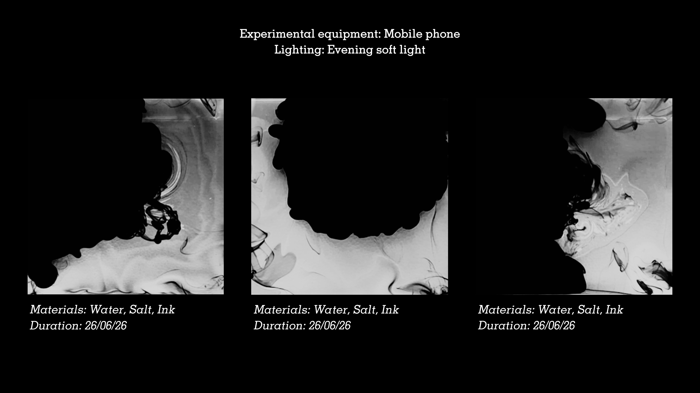
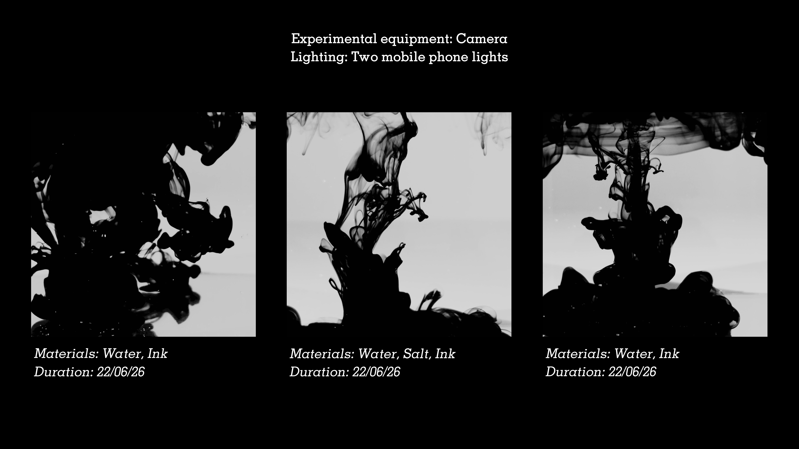
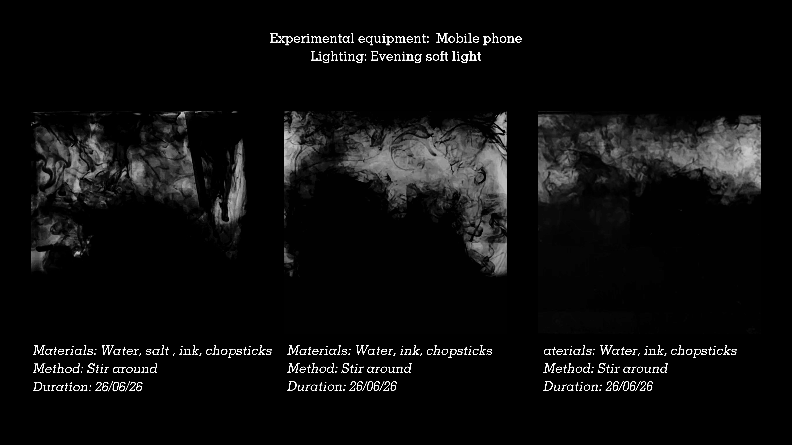
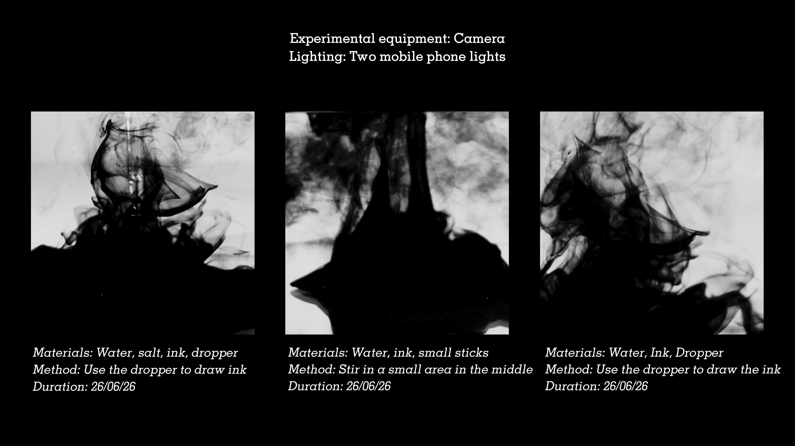

# 墨水数据集

**中文** | [English](README.md)

水中墨水的实拍摄影数据集,用于 LoRA 训练。训练出的模型负责生成 TouchDesigner 系统调用的 pre-baked latent atlas(见[项目 README](../README.zh-CN.md))。

拍摄条件、材料、授权与素材筛选决策记录在 [Dataset 拍摄与制作日志](DATASET_CAPTURE_LOG.zh-CN.md)。

## 素材来源

2026 年 6 月在家中的三场拍摄共录制 54 段视频,从中精选 26 段。每段精选视频截取四个清晰且有区别的阶段,在 Photoshop 中修去气泡、水缸底部反光等干扰元素,再裁切为单色方图——构成下文的 101 张训练图。

拍摄本身是按对照实验组织的,而不是单纯的取景:两种设备(相机 / 手机)、两种灯光环境(暗室双手机灯 / 傍晚自然柔光),以及一组材料与动作(盐、洗手液、筷子、小棍子、滴管)相互交叉。以下四张记录了各组画面背后的具体条件。









另有八张按拍摄场次(而非按条件)编排的 contact sheet,链接在[拍摄日志](DATASET_CAPTURE_LOG.zh-CN.md#详细-session-记录)中。

## 结构

```text
ink_dataset/
├── 01_pure_diffusion/   # 24 张 — 墨水在静水中自由扩散(俯拍)
├── 02_layered_ink/      # 24 张 — 墨水下沉形成悬浮分层(侧拍)
├── 03_disturbed_ink/    # 24 张 — 湍流、被扰动的墨水
└── 04_gathering_ink/    # 29 张 — 墨水凝聚成致密团块
```

共 101 张 JPEG,4320×4320,黑白。每张图配同名 `.txt` caption 文件(kohya / AI Toolkit 格式)。

## 序列

文件名编码实验序列:`<实验>-<帧>.jpg`。例如 `01_pure_diffusion` 中的 `1-1.jpg` → `1-4.jpg` 是同一次扩散过程的时间推进。序列内的帧序对应时间阶段,并写入 caption。

`04_gathering_ink` 中，系列 1–3 为滴管物理吸取；系列 4–8 为扩散视频倒放截帧（见[拍摄日志](DATASET_CAPTURE_LOG.zh-CN.md)）。

## Caption 格式

```
inkwb, <状态短语>, <阶段短语>, <视角>, <容器语境>, <实测密度>, <单图形态描述>, monochrome, high contrast
```

示例(`01_pure_diffusion/1-2.txt`):

```
inkwb, black ink diffusing freely across still water, developing phase of diffusion, top-down view, inside a shallow pale basin, dense ink covering much of the frame, ink flooding in from the upper left, marbled ripples along the lower right edge, monochrome, high contrast
```

| 部分 | 作用 |
|---|---|
| `inkwb` | 触发词(Inkward Bound 缩写)。无既有语义的词,吸收整体视觉风格。 |
| 状态短语 | 每个文件夹一条:自由扩散 / 悬浮分层 / 湍流扰动 / 凝聚收束,对应装置的系统状态。 |
| 阶段短语 | `early / developing / advanced / final phase of <过程>`,按序列内帧位置分配,生成时可控制时间阶段。 |
| 视角 | `top-down view`（01 俯拍）或 `side view`（02–04 侧拍），对应各拍摄 session 的机位。 |
| 容器语境 | `inside a shallow pale basin`（01）或 `inside a clear water tank`（02–04），个别图另加 `water surface line at the top` 等。把容器特征绑定到词汇上，生成时即可用负面提示排除。 |
| 实测密度 | 五档覆盖率短语（`sparse ink traces…` → `ink almost filling the entire frame`），由 `training/measure_ink_coverage.py` 按实测暗像素占比自动分配，为时间轴提供抽象阶段词所缺的视觉锚点。 |
| 形态描述 | 逐张手写:形状、方向、密度、留白。只有被描述过的差异在训练后才可通过提示词控制。 |
| 风格标签 | 全部 caption 共用 `monochrome, high contrast`。 |

## 与 c 值的映射

生成阶段用 caption 词汇沿收束值轴导航,例如:

- 低 c(自主扩散 / 人类扰动):`inkwb, turbulent agitated black ink in water, developing phase of disturbance`
- 中 c(潜空间寻找):`inkwb, black ink gathering and condensing in water, developing phase of gathering`
- 高 c(临时回流):`inkwb, black ink gathering and condensing in water, final phase of gathering`

## 备注

- 接近全黑的帧(如 `01/1-4`、`01/6-4`)保留,作为 `final phase of diffusion`,阶段短语赋予其语义价值。
- Caption 采用自然语言,适配 Flux / SDXL 类训练,也兼容标签式训练器。
