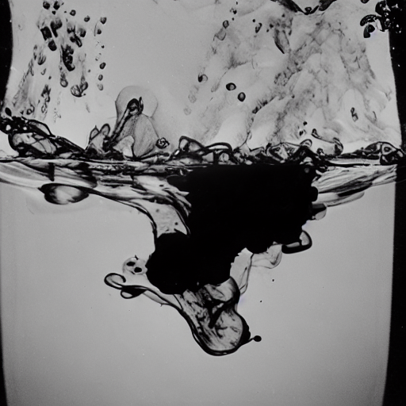
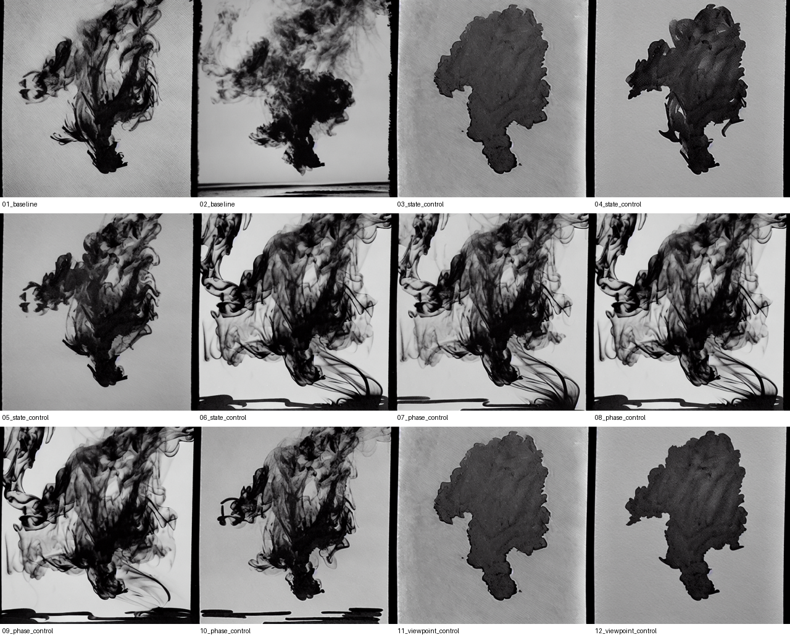
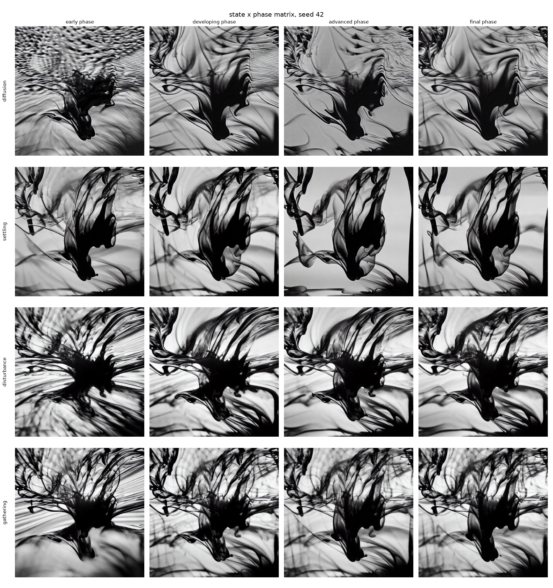
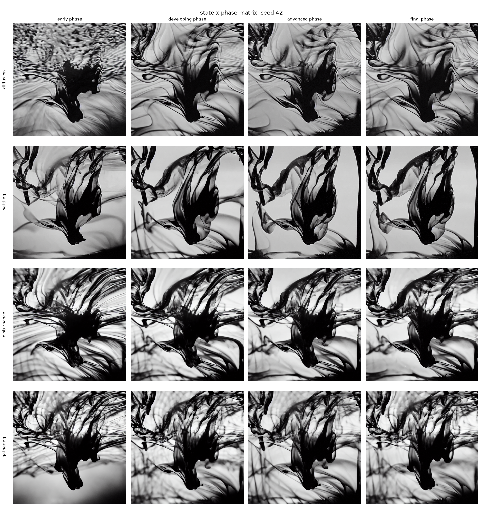
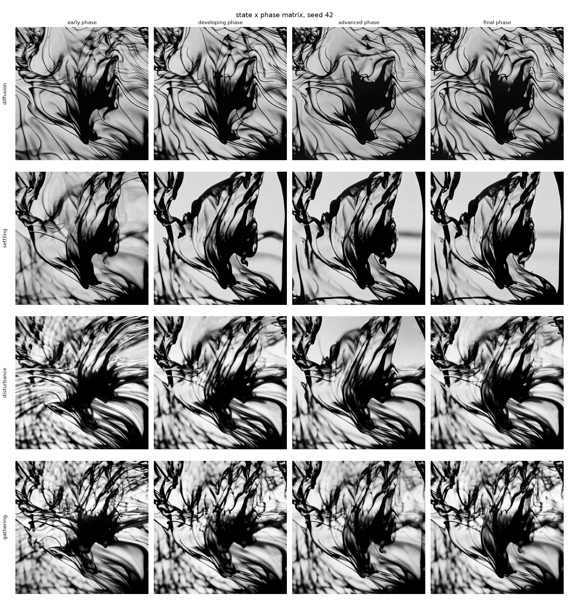
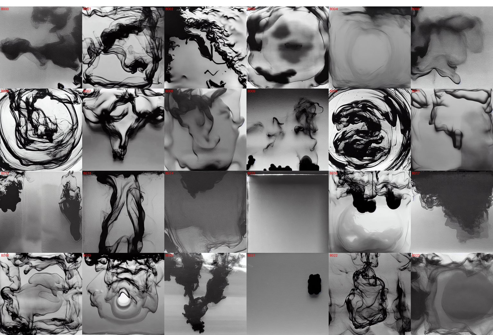
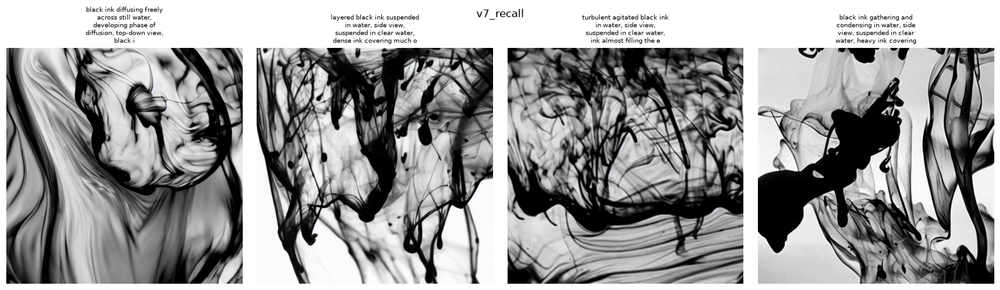

# LoRA 训练

在 [ink dataset](../ink_dataset/README.zh-CN.md) 上训练 `inkwb` 这个 LoRA,沿用了前一个项目 [The-Latent-Mycelium](https://github.com/Yeri10/The-Latent-Mycelium) 的管线(SD 1.5 + diffusers LoRA,已在 Apple Silicon / MPS 上测试过)。

[English](README.md) | **中文**

## 文件

| 文件 | 用途 |
|---|---|
| `Inkward Bound LoRA Training.ipynb` | 端到端训练 notebook(和 Mycelium 那份格式一致):环境准备 → 硬件检查 → 数据集校验 → 训练配置 → 开始训练 → 推理测试 → 结果打包 |
| `prepare_dataset.py` | 把 `ink_dataset/`(逐图 `.txt` caption)转换成 `training/dataset/`(缩放后的图片 + `metadata.jsonl`,diffusers 格式) |
| `train_text_to_image_lora.py` | 官方 diffusers LoRA 训练脚本;notebook 会重新下载和当前 diffusers 版本匹配的版本,这份本地拷贝是离线兜底方案 |
| `measure_ink_coverage.py` | 测量每张图的暗像素占比,把对应的五级密度短语写进 caption |
| `generate_atlas.py` | 沿 c 值网格(6 个分箱 × N 个种子)批量生成 latent atlas 候选图,存进 `atlas_candidates/`,并用 `manifest.jsonl` 记录每张图的 prompt/种子 |
| `dataset/` | 生成出来的训练数据,不提交进 git(caption 改动后需要重新跑一遍 `prepare_dataset.py`) |
| `runs/` | 训练输出(权重、checkpoint、日志) |

## 环境

使用 The-Latent-Mycelium 那份 `ml-art` conda 环境(`environment.yml` 在那个仓库里):

```bash
conda activate ml-art
```

## 步骤

1. 准备数据集(caption 改动后需要重新跑):

   ```bash
   python3 training/prepare_dataset.py --trim-style --v5
   ```

   `--trim` 去掉阶段短语和风格标签(v4 引入);`--v5` 去掉 01 类别 caption 里共享的水盆短语,并把 01 类别复制成两份(把俯拍聚拢墨团的观感和容器词解耦)。

2. 从仓库根目录启动训练:

   ```bash
   accelerate launch training/train_text_to_image_lora.py \
     --pretrained_model_name_or_path runwayml/stable-diffusion-v1-5 \
     --train_data_dir training/dataset \
     --resolution 512 --center_crop \
     --train_batch_size 1 --gradient_accumulation_steps 4 \
     --num_train_epochs 12 --learning_rate 5e-5 \
     --lr_scheduler constant --lr_warmup_steps 0 \
     --rank 16 --seed 42 \
     --checkpointing_steps 100 \
     --validation_prompt "inkwb, black ink gathering and condensing in water, final phase of gathering, side view, a dense black mound with a twisting tendril column above, monochrome, high contrast" \
     --validation_epochs 2 --num_validation_images 2 \
     --report_to tensorboard \
     --output_dir training/runs/inkwb_lora_v7
   ```

   不要加 `--random_flip`:caption 里编码了左右方位信息。

3. 用 `StableDiffusionPipeline.load_lora_weights` 加载权重(`training/runs/inkwb_lora_v7/pytorch_lora_weights.safetensors`)进行测试,然后扫一遍 caption 词汇表:状态词 × 阶段词 × 视角词(c 值映射关系见 [ink_dataset README](../ink_dataset/README.zh-CN.md))。

## 训练版本迭代(v1 → v7)

一共重训了七次,每一次都是被某个具体诊断出的问题推着走的,不是例行调参。每一轮完整的过程和推理都记在 [`docs/PROCESS_LOG.zh-CN.md`](../docs/PROCESS_LOG.zh-CN.md)(2026 年 7 月 6 日–14 日的条目)里,这里是精简版。

| 版本 | 要解决的问题 | 改了什么 | 结果 |
|---|---|---|---|
| v1 | 第一次训练,打基础 | 原样沿用 The-Latent-Mycelium 的超参数,caption 还没改 | 拍摄环境里的容器特征(玻璃壁、水面线、气泡)泄漏进了触发词——模型学到的是整个拍摄场景,不只是墨 |
| v2 | v1 的容器泄漏问题 | 把容器特征绑定进显式的 caption 词(`inside a shallow pale basin` / `inside a clear water tank`),加了负向提示词 | 容器特征变得可以被 prompt 控制、可以被排除,但四个阶段词在固定 seed 下依然生成出几乎一样的图——阶段轴是"平"的 |
| v3 | 阶段轴没有视觉锚点,拉不出差异 | 写了 `measure_ink_coverage.py`:测量每张图的暗像素占比,自动插入五级密度短语之一 | 阶段轴有轻微改善,但在某些 seed 下,四个状态会"塌陷"成几乎一样的图。当时的假设是:很长的共享摄影后缀稀释了状态词的权重——v4 就是为验证这个假设而训练的,而真正的原因后来发现另有出处(见 v4 行) |
| v4 | seed 相关的状态塌陷 | 精简 caption(`--trim`):训练数据里去掉阶段短语和风格标签,最长的 caption 从约 70 个 CLIP token 降到约 61 个 | v4 被采纳,atlas 生成脚本也切到了它的权重,但在固定 seed 下,矩阵和 v3 几乎无法区分(见下方证据图)——从 caption 里删词是个很弱的杠杆。而它本来要治的那个塌陷,后来被追溯到生成端而不是权重:各个分箱一直在共用同一段初始噪声,给每个分箱分配独立的 seed 区间后,不必再训练一版就恢复了状态轴(见 7 月 9 日条目) |
| v5 | 不是 v4 留下的那个问题——那个最后并不需要再训练一版。这里是另一道天花板:俯拍(c 0.0)的扩散状态怎么写都会连带召唤出真实的水盆、碗、下水道,而且已训练过的词汇无论怎么组合都突破不了,只能把修复下沉到数据层 | 从所有 01 类别的 caption 里去掉共享的水盆短语,把 01 类别的权重加倍(`--v5`) | `top-down view` 第一次能在 prompt 完全不含容器词的情况下召回"苍白背景+聚拢墨团"——但只在少数 seed 上成立;atlas 的 c 0.0 批次里大多数 seed 仍然返回碗沿、玻璃圈和图形拼贴,这个分箱依旧依赖人工策展 |
| v6 | c 0.0 还是不够自然;c 0.6 召不出细颗粒质感 | 从 01 caption 里清除了"marbled"(大理石纹)一词,明确点名"实心不透明的墨团",给 7 张 03 类别的图加上颗粒短语,恢复了阶段短语 | 四个状态保持得很干净,但两个目标都没有真正达成。c 0.0 重训之后依然需要在生成端再改一轮 prompt——构图还是得靠训练过的短语一句一句拼出来,光靠重训本身召不回来。而 c 0.6 的颗粒始终出得太粗,达不到源照片里那种细腻的雾感:颗粒短语只加在了 7 张 03 类别的图上,剩下 17 张仍然写着同样笼统的动作词,词汇层面根本没有可供模型区分的依据。这正是 v7 要解决的问题 |
| v7 | 每个类别用的都是笼统的共享动作词(比如全部 24 张 `disturbed_ink` 的图都写"turbulent, murky, churned")——caption 不分彼此,模型自然也分不出帧与帧的区别 | 把全部 101 张图的 caption 按每个类别实际记录的物理过程逐阶段重写(比如 03:墨丝被撕碎 → 溶解成颗粒 → 雾状颗粒 → 均匀浑浊) | c 0.6 的细颗粒雾第一次能稳定生成出来。这是正式投产的权重:192 张候选图精选成了最终 66 张的 latent atlas |

**每个转折点配一张证据图:**

- v1 —— 容器泄漏:
- v2 —— caption 绑定 + 负向提示词之后:

下面三条是同一个 seed(42)、同样的 prompt 在 v3、v4、v5 下的结果,可以逐行对照着看。(seed 42 属于 v3 下状态没有塌陷的那一类;塌陷的 seed 123 矩阵链接在 [`docs/PROCESS_LOG.zh-CN.md`](../docs/PROCESS_LOG.zh-CN.md) 7 月 6 日和 9 日的条目里。)

- v3 —— 四个状态可以区分,阶段轴也因为测量密度短语有了轻微的递进,但 **diffusion 行**左上角带着一片鹅卵石般的斑驳质感,这在原始照片里根本不存在 
- v4 —— 同一 seed、同样的 prompt,精简 caption 之后:逐行看下来和 v3 基本没有区别,那片斑驳质感也还在 
- v5 —— 依然是同一个 seed,而这次差异之所以读得出来,恰恰是因为它只集中在一行:**diffusion 行**(俯拍的 01 类别,也是 `--v5` 唯一改动过的 caption)里,斑驳质感消失了,换成平滑的灰色晕染和一块成形的墨团,背景是干净的浅色水面。第 2–4 行(settling / disturbance / gathering,来自 02–04 类别,caption 未改动)维持原样,而这正是它们的价值——作为对照组,说明变化来自 caption 的改动而不是采样。三张连起来看,规律是:删词什么也没推动,而把词重新瞄准之后,恰好只有被瞄准的那一行动了。需要注意这是单个 seed 下的评估矩阵;换成更长的 atlas prompt 后,同一个分箱在多数 seed 上仍不稳定,这一点记在 v5 行里 
- v6 —— c 0.0 的弧形质感回滚,第二轮:
- v7 —— recall 测试,每个新短语一张图,修好共享 seed 的 bug、并从 `generate_atlas.py` 搬来已验证过的 prompt/负向提示词之后(2026 年 7 月 28 日):
- v7 —— 最终精选的 66 张 atlas:

## 墨水 Prompt 词汇表(v7)

Inference Test cell 里所有分组共用的固定词:

| 词块 | 内容 |
|---|---|
| 触发词 | `inkwb` |
| 风格 | `monochrome, high contrast` |
| 摄影限定词 | `macro photograph, wet glossy ink, soft light` |
| 水语境锚点 | `suspended in clear water` |
| 负向提示词 | `tank walls, basin rim, bubbles, table edge, dark smears at the bottom edge, paper texture, ink on paper, photo border, dark frame edges` |

各类别的状态短语、视角/容器语境,以及 v7 caption 重写时按物理过程逐阶段写的锚点短语(完整推理见 [`docs/PROCESS_LOG.zh-CN.md`](../docs/PROCESS_LOG.zh-CN.md) 2026 年 7 月 13 日条目):

**01_pure_diffusion** —— `black ink diffusing freely across still water` · `top-down view` · `inside a shallow pale basin`
- x-1:`black ink freshly poured into the still water, pooling into a solid opaque blob`
- x-2:`curved flowing soft gray ink washes spreading outward layer by layer around the dark mass`
- x-3:`gray washes overlapping layer upon layer, ink taking over most of the pale water`
- x-4:`washes merged into a nearly solid dark sheet covering the water`

**02_layered_ink** —— `layered black ink suspended in water` · `side view` · `inside a clear water tank`
- x-1:`ink freshly injected into the water, a plume drifting down naturally`
- x-2:`translucent ink veils sinking gently, fine ink strands hanging between them, unfolding into layers`
- x-3:`veils and strands settling one over another, layered curtains of ink deepening`
- x-4:`settled ink layers merged into a dense dark depth, rounded ink droplets hanging alongside`(系列 1:注入量更大,到这一阶段已填满画面)

**03_disturbed_ink** —— `turbulent agitated black ink in water` · `side view` · `inside a clear water tank`
- x-1:`ink strands torn apart by stirring, breaking into drifting fragments`
- x-2:`broken strands dissolving into countless tiny ink particles, a fine grain mist spreading`
- x-3:`fine ink particles dispersed evenly into a hazy grain fog`
- x-4:`particles dissolved into near-uniform dark murk, faint fine grain texture remaining`

**04_gathering_ink** —— `black ink gathering and condensing in water` · `side view` · `inside a clear water tank` · 两种制作方式
- 系列 1–4(滴管吸取):`dispersed ink beginning to sink back, wisps drawn toward the dark mass below` → `ink clouds condensing downward, gathering into the dark mass` → `ink nearly regathered, the mass thickening at the bottom` → `ink regathered into a dense settled black mound, faint wisps curling above`
- 系列 5–8(视频倒放):`spread ink beginning to retract, strands drawing inward` → `ink pulling inward and upward, strands coiling into the condensing mass` → `ink condensed into a single compact dark mass suspended in the clear water`

四个类别共用:

- 阶段词:`early` / `developing` / `advanced` / `final` phase of `<process>`
- 测量密度(5 级,由 `measure_ink_coverage.py` 根据每张图的暗像素占比自动打标):`sparse ink traces, mostly clear water` → `ink spreading across part of the frame` → `dense ink covering much of the frame` → `heavy ink covering most of the frame` → `ink almost filling the entire frame`

## 评估清单

- `inkwb` 能不能还原出黑白墨水在水中的观感?
- 四个状态短语是否分别产生不同的形态?
- `early → final phase` 是否能沿着一条合理的时间轴推进?
- `top-down view` / `side view` 是否能切换镜头角度?

以上都成立之后,再沿 c 值网格批量生成预烘焙的 latent atlas,替换掉 TouchDesigner atlas 文件夹里的占位图片。

## Prompt 分组(Inference Test cell)

Notebook 里 Inference Test cell 中的 `prompt_groups` 一共跑五组,每组只孤立测试一件事。具体的 prompt 原文以 notebook 为准(会随着调优不断变化);这张表只记录每组在测什么,以及目前是否在裸状态/阶段词之外还带了额外的锚点短语。

| 分组 | 测试内容 | 状态 |
|---|---|---|
| `baseline` | `inkwb` 单独一个词能不能还原基本的墨水在水中观感 | 未改动 |
| `state_control` | 四个状态短语(diffusing / settling / disturbed / gathering)单独能不能产生不同形态 | 未改动——曾短暂给其中两条补过锚点,随后撤销,因为只改一半会让这组内部不一致(两条补过、两条裸词),这直接混淆了这组本来要做的对比。带锚点的词汇测试属于 `v7_recall` 的职责;这一组保持纯裸词测试 |
| `phase_control` | `early → final phase`(配合测量出的密度短语)能不能沿一条合理的时间轴推进 | 未改动 |
| `v7_recall` | v7 caption 重写时按类别写的物理过程短语能不能单独被模型记起来 | 改过两轮——第一轮给四条都补上了前置阶段锚点和 `{PHOTO}`,起因是 01(pure_diffusion)那条被发现渲染成了版画/雕刻感而不是照片感。第二轮(7 月 28 日)把 02–04 换成了从 `generate_atlas.py` 搬来的 prompt/负向提示词配方,其中 03 还单独配了一条负向提示词,专门用来召回细颗粒雾状质感 |
| `viewpoint_control` | `top-down view` / `side view` 单独能不能切换镜头角度 | 第 0 条(俯拍)不再是裸词——为了修复条纹/大理石纹的问题,换成了从 `generate_atlas.py` 搬来的完整 c 0.0 配方(prompt + 负向提示词)。7 月 28 日重新测试后,画面还带一些细放射状结构、不是完全平整的墨团,但作者看过后认为已经够用,这一条不再继续调 prompt。第 1 条(侧视)没动,仍是裸词 |

另外说明:采样循环现在给每张图用 `seed + index` 生成种子,而不是所有图共享同一个 `seed`——这样图片之间不再从完全相同的初始噪声出发,同一组里 prompt 之间的差异也就不会再被共享的构图骨架掩盖掉。`NEGATIVE_OVERRIDES` 和 `GUIDANCE_OVERRIDES` 现在按 `(组名, 行号)` 生效,不再是按组生效——这样 `v7_recall` 03 那条专用的负向提示词就不会再泄漏到同组的其他行。
